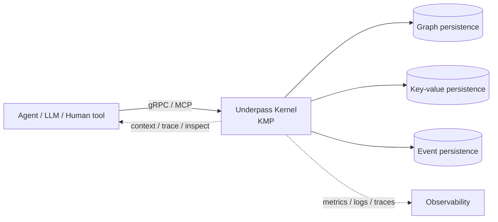
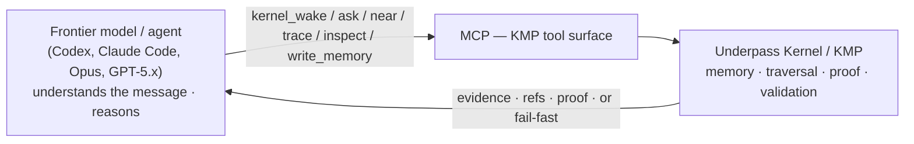
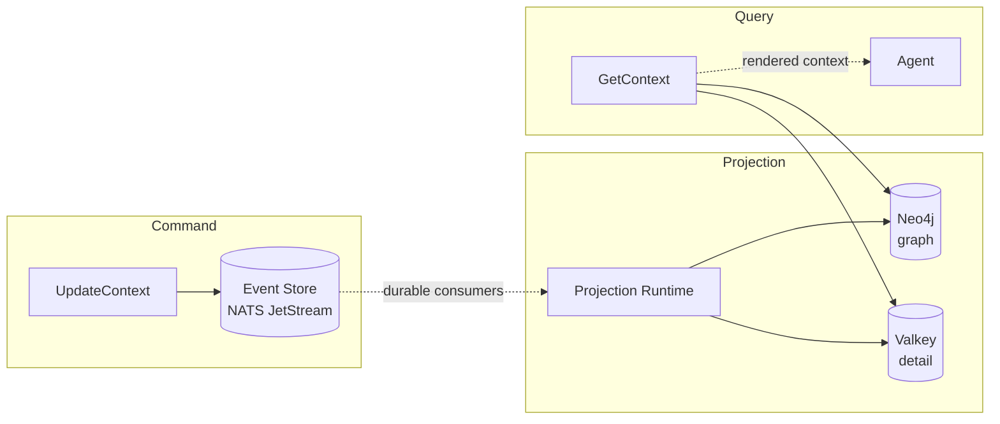

# Underpass Kernel

> Part of [Underpass AI](https://underpassai.com) — memory and execution infrastructure for reliable AI agents.

Kernel Memory Protocol for navigable, temporal, multidimensional AI agent
memory.

**New here?** Start with the [Usage Guide](./docs/usage-guide.md) — 3 steps
to give your AI agent graph-aware context with sequence diagrams and examples.

## What This Repo Is

Underpass Kernel implements Kernel Memory Protocol (KMP): an API-first memory
layer for agents, tools, and humans that need to query, traverse, inspect, and
audit process memory.

The kernel models memory around six ideas:

- **About scopes** — every memory belongs to the case, incident, task, user, or
  process it is about.
- **Dimensions** — one about can contain several dimensions: agent, session,
  attempt, subsystem, phase, artifact, or any domain-specific axis.
- **Temporal movement** — memory can be read as it was known at a moment, moved
  forward or backward, or traversed around nearby evidence.
- **Typed relations** — edges carry semantic class, relation type, rationale,
  evidence, and provenance instead of being anonymous links.
- **Inspectable evidence** — clients can ask for context, paths, nearby memory,
  node detail, and relation proof without reading raw transcripts.
- **Observable execution** — writes, projections, traces, scopes, relation
  quality, and tool behavior are measurable and auditable.

KMP is exposed through the typed `KernelMemoryService` gRPC API. MCP is an
adapter over the same semantics so LLMs can operate memory tools without owning
the memory model.

**What the kernel is NOT:**

- Not an LLM — it validates, stores, traverses, and renders memory.
- Not a benchmark solver — readers and plugins interpret recovered evidence.
- Not hidden agent state — memory is queryable through stable APIs.
- Not a vector database replacement — retrieval is graph/temporal/proof oriented.
- Not tied to one model — GPT, Claude, Qwen, Gemma, local models, and humans can
  all use the same protocol.

> **Note on "Operator".** You may see *Operator* mentioned around the benchmarks.
> **Operator is not KMP.** KMP (this kernel) is designed to be easy to use by **people and
> agents** — hence its **MCP/API duality** — and would exist, unchanged, with no Operator at
> all. **Operator is a separate, external project — not part of this kernel — and it is
> benchmark-only.** It exists solely because memory benchmarks (LongMemEval) mandate gpt‑4o,
> which operates the KMP write API poorly; Operator is a small specialist that covers that one
> gap. It is **not** a production layer and is **never** placed above a frontier model — any
> capable model operates KMP directly through MCP. Full explanation:
> **[docs/operator.md](./docs/operator.md)**.

## Why This Matters

Agents do not only need larger prompts. They need memory that can be navigated.

For real agentic work, useful questions look like this:

- What was known when this decision was made?
- Which agent, session, or attempt introduced this assumption?
- What changed later?
- Which relation explains why one step followed another?
- Which path failed, and which path became the final answer?
- Can a human inspect the same evidence without reading the raw transcript?



The current deployment adapters use Neo4j for graph persistence, Valkey for
key-value persistence, and NATS JetStream for event persistence/streaming. The
architecture keeps those choices behind ports so the protocol semantics can
move toward backend-independent conformance over time.

Current operator-model work is tracked in
[`docs/product/kernel-tool-operator-model-plan.md`](./docs/product/kernel-tool-operator-model-plan.md).
The Hugging Face publication gate and draft model/dataset cards are tracked in
[`docs/product/kernel-tool-operator-publication-plan.md`](./docs/product/kernel-tool-operator-publication-plan.md).

### KMP is operated directly through MCP

KMP is exposed through MCP as the **same tool surface an agent uses** (`kernel_wake`,
`kernel_ask`, `kernel_near`, `kernel_trace`, `kernel_inspect`, `kernel_write_memory`).
**Any capable frontier model — Claude Opus, GPT-5.x, etc. — operates KMP directly. There is
no required intermediary, and a frontier model would not route through a smaller one.**



> **Operator — a small API-use specialist (research / benchmark thread).** A separate
> external project (not part of this kernel) trains a *small* model (0.5B) to use this exact
> MCP surface. It exists only to
> cover what **gpt-4o — used here solely because the benchmark's official judge requires it,
> not by choice — does *not* do well: operating KMP**. It tests one specific claim:
> **a small model trained specifically to use an API can match a 4o / 4o-mini-class model at
> using it.** It is **not** compared to or placed above frontier
> models (Claude Opus, GPT-5.x), which operate KMP directly and would never route through it.
> Honest claim: *it predicts bounded KMP actions from a visible memory state, under a strict
> contract and real MCP replay against the kernel.* See
> [Entrenando un modelo pequeño para operar KMP](./docs/research/entrenando-un-modelo-pequeno-para-operar-kmp.md).

## Current Status

v1beta1 — production-ready RPCs, known limitations documented in
[`docs/beta-status.md`](./docs/beta-status.md).

What is in place:

- Hexagonal domain/application/adapter/transport layers
- gRPC + async (NATS) contracts with CI protection (`buf breaking`, AsyncAPI checks)
- Typed `KernelMemoryService` for Kernel Memory Protocol moves: ingest, wake,
  ask, goto, near, rewind, forward, trace, and inspect
- Installable stdio MCP adapter backed by the typed `KernelMemoryService`
- TLS on infrastructure boundaries, with mTLS on gRPC, Valkey, NATS, and OTel
  where configured. Neo4j server TLS is supported; Neo4j client-certificate
  auth is still limited by the Rust driver stack
- Workspace unit tests + container-backed integration tests +
  [LLM-as-judge E2E benchmark](./docs/testing.md#benchmark-tests-llm-as-judge)
  ([methodology](./docs/research/benchmark-methodology-v1.md))
- 5 E2E Helm tests via `helm test`, including the typed
  `KernelMemoryService` lifecycle
- Multi-resolution rendering (L0/L1/L2) with auto mode selection
- Quality metrics with OTel + Loki observability
- Helm chart with optional infrastructure sidecars and E2E test hooks

What is out of scope:

- Product-specific domain nouns (the kernel is generic)
- Product-side integration adapters, shadow mode, or rollout logic
- Authorization backend (scope validation is set-comparison only)

## Quickstart

```bash
# Toolchain: Rust 1.90.0 (pinned in rust-toolchain.toml)
cargo test --workspace               # workspace unit tests, no infra needed
bash scripts/ci/quality-gate.sh      # format + clippy + contract + tests
```

```bash
docker pull ghcr.io/underpass-ai/rehydration-kernel:latest
```

`latest` is for a quick trial; pin a `sha-<short-commit>` or `v*` tag (or a digest) in production.

Full guides: [usage](./docs/usage-guide.md) | [testing](./docs/testing.md) |
[container image](./docs/operations/container-image.md) |
[Helm deploy](./docs/operations/kubernetes-deploy.md)

### Verify a deployment

```bash
# Enable E2E tests and run against live cluster
helm upgrade rehydration-kernel charts/rehydration-kernel \
  --reuse-values --set e2e.enabled=true

helm test rehydration-kernel --timeout 5m
# Helm hooks cover transport/mTLS smoke plus the typed KernelMemoryService lifecycle.
```

Tests require the `e2e-client-tls` secret (same CA used by the kernel).
See `charts/rehydration-kernel/values.yaml` for full E2E configuration.

## Architecture

The kernel uses **CQRS with Event Sourcing**:

- **Command side**: `UpdateContext` validates, appends events to an append-only
  store (NATS JetStream or Valkey), with optimistic concurrency (revision check)
  and idempotency key outcome recording
- **Projection**: NATS JetStream durable consumers materialize events into the
  read model (Neo4j for graph, Valkey for detail). Explicit ack, at-least-once delivery
- **Query side**: `GetContext`, `GetContextPath`, `RehydrateSession` read from
  the materialized projections and render token-budgeted text



> Infrastructure connections support TLS where the backend supports it. gRPC,
> Valkey, NATS, and OTLP can run with mTLS through Helm/env configuration.
> Neo4j server TLS is supported; Neo4j client-certificate auth remains partial.

DDD, hexagonal boundaries, one concept per file, one use case per file.

**Infrastructure:**

- **Neo4j** — graph read model (nodes, relationships, traversal)
- **Valkey** — node detail, snapshots, projection state (dedup + checkpoints)
- **NATS JetStream** — event store (append-only, file-backed) + projection event bus
- **gRPC + TLS/mTLS** — supports plaintext, server TLS, mutual TLS (default: plaintext)
- **cl100k_base** — BPE tokenization (tiktoken-rs) for accurate token budgets
- **OpenTelemetry + Loki** — OTLP metric instruments + structured JSON logs. See [observability](./docs/observability.md)
- **Helm chart** — optional Neo4j/NATS/Valkey/Loki/Grafana/OTel Collector sidecars

## Multi-Resolution Rendering

Every render produces three tiers simultaneously. Consumers pick the level
they need — no separate API calls, no re-rendering.

```
  L0 Summary          ~100 tokens    objective, status, blocker, next action
  L1 Causal Spine     ~500 tokens    root → focus → causal/motivational/evidential chain
  L2 Evidence Pack    remaining      structural relations, neighbors, extended details
```

| Use case | Tier | Why |
|:---------|:----:|:----|
| Status check / quick triage | L0 | Fits in a system prompt alongside other tools |
| Failure diagnosis / handoff resume | L0 + L1 | Causal chain is the dominant signal |
| Deep analysis / full audit | L0 + L1 + L2 | Everything the graph knows, salience-ordered |

**RehydrationMode** auto-selects strategy based on token pressure, endpoint
type, focus path, and causal density:

- **ReasonPreserving** (default) — all tiers populated, full signal
- **ResumeFocused** — prunes distractor branches, keeps only the causal spine.
  Under 8x budget reduction (4096 → 512): -3pp task accuracy, +17pp recovery

Control via `max_tier` on the request or let the kernel decide with `rehydration_mode = AUTO`.

## Security

Infrastructure boundaries support TLS where the backend supports it. The gRPC
transport supports mTLS; Valkey, NATS, and OTLP can also use client
certificates through Helm/env configuration. Neo4j currently supports server
TLS/CA trust in the kernel chart; Neo4j client-certificate auth is pending
driver support.

| Boundary | Transport | Authentication |
|:---------|:----------|:---------------|
| Callers → Kernel | gRPC with server TLS or **mTLS** | Client certificate validation against trusted CA |
| Kernel → Neo4j | `bolt+s://` / `neo4j+s://` with CA pinning | URI-embedded credentials via K8s secrets |
| Kernel → Valkey | `rediss://` with **mTLS** | Client certificate + key from secrets |
| Kernel → NATS | TLS with CA pinning, `tls_first` | Client certificate or NATS credentials |
| Kernel → OTel Collector | gRPC with optional **mTLS** via env vars | `OTEL_EXPORTER_OTLP_CA_PATH`, `_CERT_PATH`, `_KEY_PATH` |

Commands are protected by **idempotency key outcome recording** and **optimistic concurrency**
(revision + content hash). Credentials are never inlined — always mounted from
Kubernetes secrets.

Full threat model and Helm TLS configuration: [security-model.md](./docs/security-model.md)

## Contracts

- [gRPC proto](./api/proto/underpass/rehydration/kernel/v1beta1) |
  [AsyncAPI](./api/asyncapi/context-projection.v1beta1.yaml) |
  [examples](./api/examples/README.md)
- [Integration contract](./docs/migration/kernel-node-centric-integration-contract.md) — what consumers can depend on
- [Beta status](./docs/beta-status.md) — maturity, limitations, path to v1

## Repo Layout

```
api/proto/          gRPC contracts (v1beta1)
api/asyncapi/       async contracts (NATS JetStream)
api/examples/       request, response, and event fixtures
crates/
  rehydration-domain/       domain model, value objects, invariants
  rehydration-application/  use cases, rendering pipeline
  rehydration-adapter-*/    Neo4j, Valkey, NATS adapters
  rehydration-transport-*/  gRPC server, proto mapping
  rehydration-observability/ OTel + Loki quality observers
  rehydration-server/       composition root
  rehydration-testkit/      dataset generator, evaluation harness
  rehydration-tests-*/      integration + benchmark tests
charts/             Helm chart (kernel + optional sidecars)
docs/               guides, operations, security, observability, testing
scripts/ci/         quality gates, integration runners, coverage
```

## Benchmark

432 LLM-as-judge evaluations across two independent judges (GPT-5.4 and
Claude Sonnet 4.6), three graph scales, four noise conditions, and three
random seeds. Null hypothesis rejected at 95% confidence.

| Context type | Task | Recovery | Reason | Gap vs structural |
|:-------------|:----:|:--------:|:------:|:-----------------:|
| **Explanatory** (kernel) | **72%** [56%, 84%] | **75%** [59%, 86%] | **72%** [56%, 84%] | **+69pp** |
| Structural (edges only) | 3% [0%, 14%] | 0% [0%, 10%] | 0% [0%, 10%] | baseline |
| **Mixed** (both) | **92%** [78%, 97%] | **81%** [65%, 90%] | **89%** [75%, 96%] | **+89pp** |

> Agent: Qwen3-8B with chain-of-thought (local). Judge: GPT-5.4. Wilson 95% CI in brackets.
> Cross-judge validated: Sonnet 4.6 produces the same gap (+67pp).
> Synthetic graphs, not production workloads.
> Full results, methodology, and statistical analysis: [docs/research/](./docs/research/)

## Research

The repository includes a paper draft on explanatory graph context
rehydration: [docs/research/](./docs/research/)

## Legal

Copyright © 2026 Tirso García Ibáñez.

This repository is part of the Underpass AI project.
Licensed under the Apache License, Version 2.0, unless stated otherwise.

Redistributions and derivative works must preserve applicable copyright,
license, and NOTICE information.

Original author: [Tirso García Ibáñez](https://github.com/tgarciai) · [LinkedIn](https://www.linkedin.com/in/tirsogarcia/) · [Underpass AI](https://github.com/underpass-ai)

## Running E2E tests

Run `./scripts/e2e/regen.sh` before live E2E, replay validation, or infra-touching checks. It automates the version preflight in [docs/operations/preflight.md](docs/operations/preflight.md) and reports stale binaries, drifted Helm/Kubernetes state, missing certs, or endpoint/model mismatches before expensive tests run.

Example:

```bash
./scripts/e2e/regen.sh --verbose
```

Expected output uses `[OK]`, `[WARN]`, and `[FAIL]` lines and ends with an `N/M checks passed` summary.
