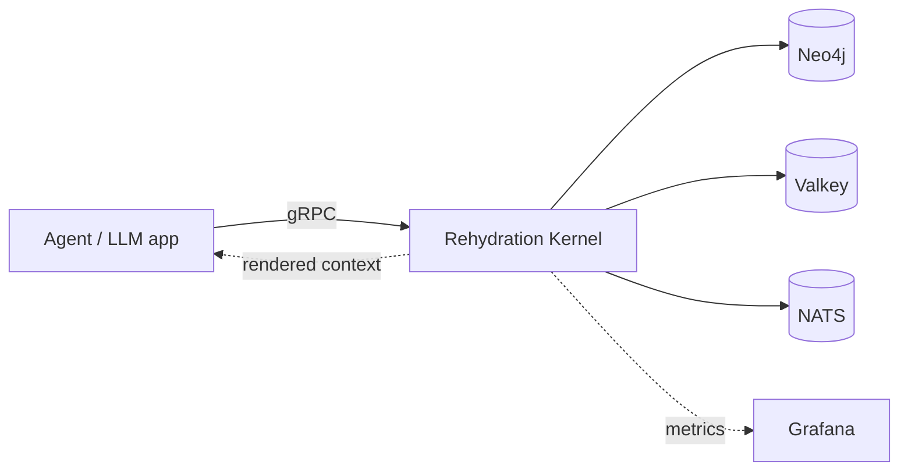

# Rehydration Kernel

**Graph-native context engine for AI agents.** Turns knowledge graphs into
LLM-ready text — with the *why*, not just the *what*.

```
Agent asks: "What failed and where should I restart?"

Without kernel:  3% accuracy — the model guesses.
With kernel:    72% accuracy — the model reasons from causal chains.
```

## The Problem

AI agents need context to reason. Most systems dump raw documents or vector
search results into the prompt. The agent gets *what exists* but not *why it
exists*, *what caused it*, or *where to recover from*.

When an LLM lacks causal metadata, it fabricates plausible-sounding rationale.
Without ground truth, consumers cannot tell the difference.

## The Solution

`rehydration-kernel` serves structured graph context with **explanatory
relationships** — each edge carries semantic class (causal, motivational,
evidential), rationale, method, decision linkage, and causal ordering.

The kernel provides three things no RAG system does:

1. **Causal chains** — not just neighbors, but *why* each node exists
2. **Token-budgeted rendering** — multi-resolution tiers (L0 summary → L1
   causal spine → L2 evidence) with a planner that preserves the important
   signal under pressure
3. **Domain-level observability** — the kernel knows what rationale exists
   in the graph (`causal_density`), making LLM fabrication deterministically
   detectable without a second model

## Evidence

432 evaluations across two independent judges (GPT-5.4 and Claude Sonnet 4.6),
three graph scales, four noise conditions, and three random seeds.
Null hypothesis (no difference) rejected at 95% confidence.

| Context type | Task accuracy | Recovery accuracy | Reason preserved |
|:-------------|:------------:|:-----------------:|:----------------:|
| **Explanatory** (kernel) | **72%** [56%, 84%] | **75%** [59%, 86%] | **72%** [56%, 84%] |
| Structural (edges only) | 3% [0%, 14%] | 0% [0%, 10%] | 0% [0%, 10%] |
| **Mixed** (both) | **92%** [78%, 97%] | **81%** [65%, 90%] | **89%** [75%, 96%] |

> Agent: Qwen3-8B (local, 8B params). Judge: GPT-5.4. 95% Wilson CI in brackets.
> Gap: **+69pp** [+53pp, +83pp]. Full methodology: [docs/research/](./docs/research/)

**Key findings:**

- **+69pp accuracy gap** — the kernel provides the information the model needs
  to reason about failure chains. Without it, the model scores 3%.
- **Mixed > Explanatory** — structural topology + causal rationale compound
  (92% vs 72%). The kernel serves both signals.
- **0% fabrication with thinking** — without chain-of-thought, 89% of structural
  responses are fabricated with high confidence. With CoT enabled, 0%.
  The kernel's `causal_density` makes this deterministically detectable.
- **Robust under 8x token compression** — the planner preserves task accuracy
  (-3pp) and improves recovery (+17pp) at budget=512 vs 4096.

## Architecture



**CQRS + Event Sourcing.** Commands append to NATS JetStream. Projections
materialize into Neo4j (graph) and Valkey (detail). Queries render
token-budgeted text from the read model.

**DDD, hexagonal architecture.** Domain has zero infrastructure dependencies.
Ports in domain, adapters implement them. One concept per file, one use case
per file. 270 unit tests + 9 container-backed integration tests.

**Infrastructure:** Neo4j, Valkey, NATS JetStream, gRPC with TLS/mTLS,
cl100k_base tokenization, OpenTelemetry + Loki. Helm chart with optional
sidecars.

## Multi-Resolution Rendering

Every render produces three tiers. Consumers pick what they need:

```
  L0 Summary          ~100 tokens    objective, status, blocker, next action
  L1 Causal Spine     ~500 tokens    root → focus → causal chain with rationale
  L2 Evidence Pack    remaining      structural relations, neighbors, details
```

The **planner** auto-selects strategy based on token pressure, endpoint type,
focus path, and causal density:

- **ReasonPreserving** — all tiers, full signal
- **ResumeFocused** — prunes distractors, keeps only the causal spine.
  Under 8x budget reduction: -3pp task accuracy, +17pp recovery

## Quickstart

```bash
cargo test --workspace               # 270 unit tests, no infra needed
docker pull ghcr.io/underpass-ai/rehydration-kernel:latest
```

Full guides: [usage](./docs/usage-guide.md) | [testing](./docs/testing.md) |
[Helm deploy](./docs/operations/kubernetes-deploy.md) |
[security](./docs/security-model.md)

## Current Status

**v1beta1** — production-ready RPCs, known limitations documented in
[`docs/beta-status.md`](./docs/beta-status.md).

| What's in | What's not |
|-----------|-----------|
| Hexagonal domain/application/adapter/transport | Product-specific domain nouns |
| gRPC + NATS contracts with CI protection | Authorization backend |
| TLS/mTLS on all boundaries | Product-side integration adapters |
| Multi-resolution rendering with auto mode | Vector search or embeddings |
| Quality metrics + OTel + Loki observability | |
| Helm chart with optional sidecars | |

## Security

All infrastructure boundaries support TLS. gRPC and Valkey support mTLS.

| Boundary | Transport | Auth |
|:---------|:----------|:-----|
| Callers → Kernel | gRPC + **mTLS** | Client certificate |
| Kernel → Neo4j | `bolt+s://` with CA pinning | K8s secrets |
| Kernel → Valkey | `rediss://` + **mTLS** | Client cert + key |
| Kernel → NATS | TLS + `tls_first` | Client certificate |

Commands protected by idempotency keys + optimistic concurrency (revision +
SHA-256 content hash). Full threat model: [security-model.md](./docs/security-model.md)

## Contracts

- [gRPC proto](./api/proto/underpass/rehydration/kernel/v1beta1) |
  [AsyncAPI](./api/asyncapi/context-projection.v1beta1.yaml) |
  [examples](./api/examples/README.md)
- [Integration contract](./docs/migration/kernel-node-centric-integration-contract.md)
- [Beta status](./docs/beta-status.md)

## Repo Layout

```
api/proto/          gRPC contracts (v1beta1)
api/asyncapi/       async contracts (NATS JetStream)
crates/
  rehydration-domain/       domain model, value objects, ports
  rehydration-application/  use cases, rendering pipeline, planner
  rehydration-adapter-*/    Neo4j, Valkey, NATS adapters
  rehydration-transport-*/  gRPC server, proto mapping
  rehydration-server/       composition root
  rehydration-testkit/      dataset generator, LLM evaluation harness
charts/             Helm chart (kernel + optional sidecars)
docs/               guides, operations, security, research
```

## Research

The repository includes a research paper draft with 432-eval LLM-as-judge
evidence across five use cases (failure diagnosis, implementation
justification, interrupted handoff, token pressure, fabrication detection):
[docs/research/](./docs/research/)

## License

Apache-2.0. See [`LICENSE`](./LICENSE).
