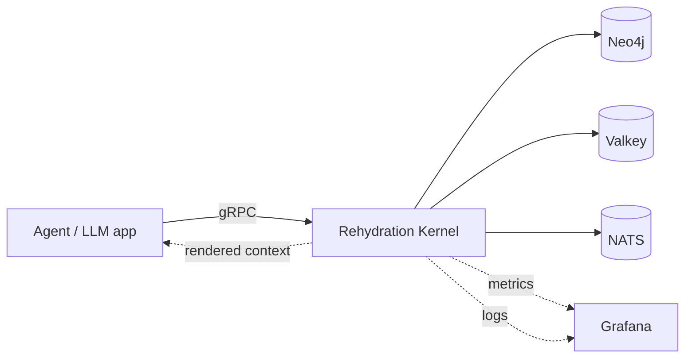
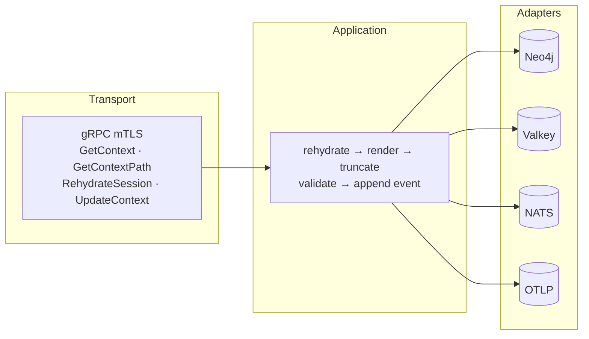

# Rehydration Kernel

Node-centric context rehydration for agentic systems.

**New here?** Start with the [Usage Guide](./docs/usage-guide.md) — 3 steps
to give your AI agent graph-aware context with sequence diagrams and examples.

## What This Repo Is

`rehydration-kernel` is a generic context engine that turns knowledge graphs
into LLM-ready text. It is built around four concepts:

- **Nodes** — entities in the graph (incidents, decisions, tasks, artifacts). Each
  carries kind, status, summary, and optional provenance (who said it, when)
- **Relationships** — the core signal. Each edge carries a **semantic class**
  (causal, motivational, evidential, constraint, procedural, structural) plus
  **rationale** (why it exists), **method** (how), **decision_id**, **caused_by_node_id**,
  and **sequence** (step order). This explanatory metadata is what lets the LLM
  reason about *why things happened*, not just *what is connected to what*
- **Extended node detail** — rich per-node content (logs, configs, error traces)
  persisted in Valkey, loaded in batch (MGET). Separated from the graph to keep
  Neo4j lean and detail updates fast without graph writes
- **Salience ordering** — relationships are ranked by explanatory weight
  (causal > motivational > evidential > constraint > procedural > structural).
  Under token pressure, the kernel preserves causal chains and drops structural noise

**What the kernel is NOT:**

- Not an LLM — it does not generate text, only structures and renders context
- Not a RAG system — it does not do similarity search; it traverses a typed graph
- Not a vector database — relationships have semantic classes and rationale, not embeddings
- Not tied to any model — works with GPT, Claude, Llama, Qwen, or any LLM



The kernel does not own product-specific nouns. Integrating products are
expected to map their own domain language to this graph model at the edge.
The kernel also assumes its own infrastructure dependencies are present:
Neo4j, Valkey, and NATS are required runtime components, not optional features.

## Current Status

v1beta1 — production-ready RPCs, known limitations documented in
[`docs/beta-status.md`](./docs/beta-status.md).

What is in place:

- Hexagonal domain/application/adapter/transport layers
- gRPC + async (NATS) contracts with CI protection (`buf breaking`, AsyncAPI checks)
- TLS/mTLS on all infrastructure boundaries (except OTLP — in progress)
- 270 unit tests + 9 container-backed integration tests + 4 LLM benchmarks
- Multi-resolution rendering (L0/L1/L2) with auto mode selection
- Quality metrics with OTel + Loki observability
- Helm chart with optional infrastructure sidecars

What is out of scope:

- Product-specific domain nouns (the kernel is generic)
- Product-side integration adapters, shadow mode, or rollout logic
- Authorization backend (scope validation is set-comparison only)

## Quickstart

```bash
# Toolchain: Rust 1.90.0 (pinned in rust-toolchain.toml)
cargo test --workspace               # 270 unit tests, no infra needed
bash scripts/ci/quality-gate.sh      # format + clippy + contract + tests
```

```bash
docker pull ghcr.io/underpass-ai/rehydration-kernel:latest
```

Full guides: [usage](./docs/usage-guide.md) | [testing](./docs/testing.md) |
[container image](./docs/operations/container-image.md) |
[Helm deploy](./docs/operations/kubernetes-deploy.md)

## Architecture



> All connections TLS. gRPC and Valkey support mTLS. OTLP is plaintext (mTLS in progress).

Non-negotiable rules: DDD first, hexagonal boundaries, one concept per file,
one use case per file.

**Infrastructure:**

- **Neo4j** — graph state (nodes, relationships, traversal)
- **Valkey** — node detail, snapshots, event store (RESP protocol, batch MGET)
- **NATS JetStream** — projection events, command event store (optimistic concurrency)
- **gRPC + TLS/mTLS** — supports plaintext, server TLS, mutual TLS (default: plaintext)
- **cl100k_base** — BPE tokenization (tiktoken-rs) for accurate token budgets
- **OpenTelemetry + Loki** — 16 active instruments (+ 2 defined, not yet recorded) + structured JSON logs. See [observability](./docs/observability.md)
- **Helm chart** — optional Neo4j/NATS/Valkey/Loki/Grafana/OTel Collector sidecars

## Multi-Resolution Rendering

Every render produces three tiers simultaneously. Consumers pick the level
they need — no separate API calls, no re-rendering.

```
  L0 Summary          ~100 tokens    objective, status, blocker, next action
  L1 Causal Spine     ~500 tokens    root → focus → causal/motivational/evidential chain
  L2 Evidence Pack    remaining      structural relations, neighbors, extended details
```

| Use case | Tier | Why |
|:---------|:----:|:----|
| Status check / quick triage | L0 | Fits in a system prompt alongside other tools |
| Failure diagnosis / handoff resume | L0 + L1 | Causal chain is the dominant signal |
| Deep analysis / full audit | L0 + L1 + L2 | Everything the graph knows, salience-ordered |

**RehydrationMode** auto-selects strategy based on token pressure:

- **ReasonPreserving** (default) — all tiers populated, full signal
- **ResumeFocused** — auto-activates when budget < 30 tokens/node; prunes distractor branches, keeps only the causal spine. Fixed `stress@512` from 0/3 to 3/3

Control via `max_tier` on the request or let the kernel decide with `rehydration_mode = AUTO`.

## Security

All infrastructure boundaries support TLS. The gRPC transport supports mTLS.

| Boundary | Transport | Authentication |
|:---------|:----------|:---------------|
| Callers → Kernel | gRPC with server TLS or **mTLS** | Client certificate validation against trusted CA |
| Kernel → Neo4j | `bolt+s://` / `neo4j+s://` with CA pinning | URI-embedded credentials via K8s secrets |
| Kernel → Valkey | `rediss://` with **mTLS** | Client certificate + key from secrets |
| Kernel → NATS | TLS with CA pinning, `tls_first` | Client certificate or NATS credentials |
| Kernel → OTel Collector | **Plaintext** gRPC (mTLS in progress) | None — co-locate or network-isolate |

Commands are protected by **idempotency key outcome recording** and **optimistic concurrency**
(revision + content hash). Credentials are never inlined — always mounted from
Kubernetes secrets.

Full threat model and Helm TLS configuration: [security-model.md](./docs/security-model.md)

## Contracts

- [gRPC proto](./api/proto/underpass/rehydration/kernel/v1beta1) |
  [AsyncAPI](./api/asyncapi/context-projection.v1beta1.yaml) |
  [examples](./api/examples/README.md)
- [Integration contract](./docs/migration/kernel-node-centric-integration-contract.md) — what consumers can depend on
- [Beta status](./docs/beta-status.md) — maturity, limitations, path to v1

## Repo Layout

```
api/proto/          gRPC contracts (v1beta1)
api/asyncapi/       async contracts (NATS JetStream)
api/examples/       request, response, and event fixtures
crates/
  rehydration-domain/       domain model, value objects, invariants
  rehydration-application/  use cases, rendering pipeline
  rehydration-adapter-*/    Neo4j, Valkey, NATS adapters
  rehydration-transport-*/  gRPC server, proto mapping
  rehydration-observability/ OTel + Loki quality observers
  rehydration-server/       composition root
  rehydration-testkit/      dataset generator, evaluation harness
  rehydration-tests-*/      integration + benchmark tests
charts/             Helm chart (kernel + optional sidecars)
docs/               guides, operations, security, observability, testing
scripts/ci/         quality gates, integration runners, coverage
```

## Benchmark (preliminary)

LLM-as-judge evaluation with GPT-5.4, Claude Opus 4, and Qwen3-8B.
Explanatory relationships consistently outperform structural-only (27-72pp gap):

| Model | Budget | Explanatory | Structural | Gap |
|:------|:------:|:-----------:|:----------:|:---:|
| GPT-5.4 (frontier) | 4096 | 17/18 (94%) | 11/18 (61%) | 33pp |
| Qwen3-8B (local 8B) | 4096 | 18/18 (100%) | 9/18 (50%) | 50pp |
| Qwen3-8B + ResumeFocused | **512** | **16/18 (89%)** | 5/18 (28%) | 61pp |
| Qwen3-8B + competing noise | 4096 | **18/18 (100%)** | 5/18 (28%) | **72pp** |

> Preliminary — single seed, single judge. Full matrix planned.
> Synthetic graphs, not production workloads.
> Full results and methodology: [docs/research/](./docs/research/)

## Research

The repository includes a paper draft on explanatory graph context
rehydration: [docs/research/](./docs/research/)

## License

Apache-2.0. See [`LICENSE`](./LICENSE).
