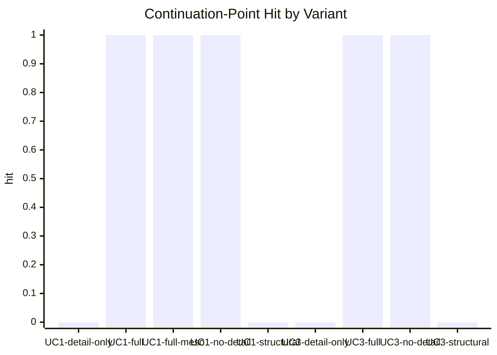
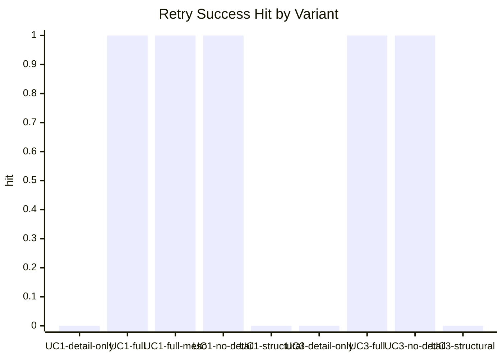

# Paper Use Case Figures

Source: `artifacts/paper-use-cases/summary.json`

Legend:
- `full`: full explanatory relations with detail
- `no-detail`: full explanatory relations without detail
- `structural`: structural-only relations with detail
- `detail-only`: structural relations with explanation injected into node detail
- `*@96`: same relation/detail mode rendered with a 96-token budget
- `*-meso`: same variant over a denser noisy graph

## Figure 1. Causal Reconstruction Score By Variant

```mermaid
xychart-beta
    title "Causal Reconstruction Score by Use Case and Variant"
    x-axis [UC1-detail-only, UC1-full, UC1-full-meso, UC1-no-detail, UC1-structural, UC2-detail-only, UC2-full, UC2-no-detail, UC2-structural, UC3-detail-only, UC3-full, UC3-no-detail, UC3-structural, UC4-full, UC4-full@192, UC4-full@96, UC4-structural@96]
    y-axis "score" 0 --> 1
    bar [0.42857142857142855, 1.0, 1.0, 0.8571428571428571, 0.14285714285714285, 0.42857142857142855, 1.0, 0.8571428571428571, 0.14285714285714285, 0.42857142857142855, 1.0, 0.8571428571428571, 0.14285714285714285, 1.0, 1.0, 1.0, 0.125]
```

## Figure 2. Rendered Token Count By Variant

```mermaid
xychart-beta
    title "Rendered Token Count by Use Case and Variant"
    x-axis [UC1-detail-only, UC1-full, UC1-full-meso, UC1-no-detail, UC1-structural, UC2-detail-only, UC2-full, UC2-no-detail, UC2-structural, UC3-detail-only, UC3-full, UC3-no-detail, UC3-structural, UC4-full, UC4-full@192, UC4-full@96, UC4-structural@96]
    y-axis "tokens" 0 --> 585
    bar [245, 282, 282, 252, 200, 247, 285, 255, 203, 441, 575, 535, 374, 223, 175, 89, 73]
```

## Figure 3. Continuation-Point Recovery For Operational Cases



## Figure 4. Dominant-Reason Preservation

```mermaid
xychart-beta
    title "Dominant-Reason Hit by Variant"
    x-axis [UC4-full, UC4-full@192, UC4-full@96, UC4-structural@96]
    y-axis "hit" 0 --> 1
    bar [1, 1, 1, 0]
```

## Figure 5. Closed-Loop Retry Success For Operational Cases


