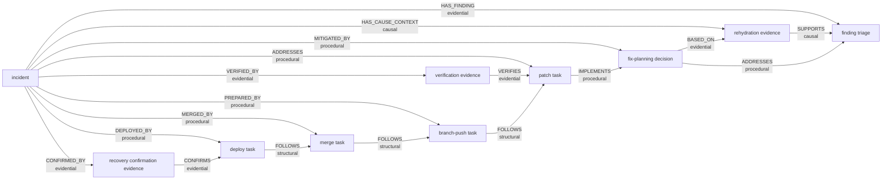

# PIR Kernel Graph Inspection Report: Late Waves

Status: completed live inspection
Date: 2026-04-12
Scope: detailed graph dump for the live `PIR -> kernel` smoke after adding late
operational waves and truthful post-stage root projection

This document records a direct inspection of the materialized kernel graph for
one real `PIR` incident run after extending the builder to publish
`branch_push`, `merge`, `deploy`, and `recovery_confirmation`, and after
changing the wave projection so the root is published with the post-success
state of the run.

It is intentionally exhaustive at the graph layer: all observed nodes, all
observed relationships, all observed `node_detail` payloads, one diagram of the
graph shape, and an honest analysis of what this particular run did and did not
achieve.

## Snapshot

Inspected incident identity:

- `incident_id`: `1b8d9a8c-44e1-430a-a51b-36ce6c633808`
- `incident_run_id`: `40028a75-a523-4d94-b98a-3d9ee3f07ab0`
- `source_alert_id`: `smoke-late-waves-20260412-0026`

Inspection path:

- source system: live `PIR` deployment in `underpass-runtime`
- query path: kernel `GetContext`
- requested scopes: `graph`, `details`
- depth: `6`
- token budget: `4096`
- rehydration mode: `REHYDRATION_MODE_REASON_PRESERVING`

Observed bundle stats:

- `roles`: `1`
- `nodes`: `10`
- `relationships`: `18`
- `detailed_nodes`: `9`

Observed rendered bundle metadata:

- `resolved_mode`: `REHYDRATION_MODE_REASON_PRESERVING`
- `raw_equivalent_tokens`: `3578`
- `compression_ratio`: `1.0255087417598165`
- `causal_density`: `0.4444444444444444`
- `detail_coverage`: `0.9`
- `budget_requested`: `4096`
- `budget_used`: `3466`
- `total_before_truncation`: `3706`
- `sections_kept`: `34`
- `sections_dropped`: `3`
- `content_hash`: `render:9618218d39f6dc13490a7583077e55312a807fb3d33453ab61094851a32e16b5`

Important boundary condition:

- this snapshot reflects the graph materialized in the kernel after the full
  `PIR` workflow reached `recovery_confirmation`
- unlike the earlier inspection, this one already includes late operational
  nodes and a truthful root lifecycle state
- the render is already under light truncation pressure, so this run also
  exposes the next real scaling boundary for `PIR -> kernel` consumption

## Root Node

```yaml
node_id: incident:1b8d9a8c-44e1-430a-a51b-36ce6c633808
node_kind: incident
title: "Payments-Api incident from alert smoke-late-waves-20260412-0026"
summary: "Incident for payments-api in production. Severity SEV1. Current stage recovery_confirmation. Current status resolved."
status: RESOLVED
labels:
  - incident
  - payments-api
  - production
  - sev1
properties:
  current_stage: recovery_confirmation
  environment: production
  human_escalation: ""
  incident_id: 1b8d9a8c-44e1-430a-a51b-36ce6c633808
  incident_run_id: 40028a75-a523-4d94-b98a-3d9ee3f07ab0
  service: payments-api
  severity: SEV1
  source_alert_id: smoke-late-waves-20260412-0026
```

## Neighbor Nodes

### 1. Triage Finding

```yaml
node_id: finding:1b8d9a8c-44e1-430a-a51b-36ce6c633808:triage
node_kind: finding
title: "Initial triage assessment"
summary: "Initial triage assessment"
status: OBSERVED
labels:
  - finding
  - triage
  - pir
  - diagnose
properties:
  action_type: diagnose
  confidence: high
  environment: production
  incident_id: 1b8d9a8c-44e1-430a-a51b-36ce6c633808
  incident_run_id: 40028a75-a523-4d94-b98a-3d9ee3f07ab0
  output_ref: triage://40028a75-a523-4d94-b98a-3d9ee3f07ab0/63770d98-5bc8-4944-b5d9-600187b88303
  relation_type: HAS_FINDING
  semantic_hint: evidential
  service: payments-api
  severity: SEV1
  source_alert_id: smoke-late-waves-20260412-0026
  stage: triage
  task_id: 63770d98-5bc8-4944-b5d9-600187b88303
provenance:
  source_kind: SOURCE_KIND_AGENT
  source_agent: pir-triage
  observed_at: 2026-04-12T00:23:44Z
```

### 2. Rehydration Evidence

```yaml
node_id: evidence:1b8d9a8c-44e1-430a-a51b-36ce6c633808:rehydration
node_kind: evidence
title: "Rehydrated causal context"
summary: "Contextual investigation package assembled"
status: ASSEMBLED
labels:
  - evidence
  - rehydration
  - pir
  - retrieve-context
properties:
  action_type: retrieve-context
  caused_by_node_id: evidence:1b8d9a8c-44e1-430a-a51b-36ce6c633808:rehydration
  confidence: medium
  environment: production
  incident_id: 1b8d9a8c-44e1-430a-a51b-36ce6c633808
  incident_run_id: 40028a75-a523-4d94-b98a-3d9ee3f07ab0
  output_ref: rehydration://40028a75-a523-4d94-b98a-3d9ee3f07ab0/d90d51b9-e8df-4581-bc74-9427abef97d3
  relation_type: HAS_CAUSE_CONTEXT
  semantic_hint: causal
  service: payments-api
  severity: SEV1
  source_alert_id: smoke-late-waves-20260412-0026
  stage: rehydration
  task_id: d90d51b9-e8df-4581-bc74-9427abef97d3
provenance:
  source_kind: SOURCE_KIND_AGENT
  source_agent: pir-rehydration
  observed_at: 2026-04-12T00:23:48Z
```

### 3. Fix Planning Decision

```yaml
node_id: decision:1b8d9a8c-44e1-430a-a51b-36ce6c633808:fix-planning
node_kind: decision
title: "Decision: Apply connection timeout patch"
summary: "Remediation strategy identified"
status: PROPOSED
labels:
  - decision
  - fix_planning
  - pir
  - plan-remediation
properties:
  action_type: plan-remediation
  confidence: high
  decision_id: decision:1b8d9a8c-44e1-430a-a51b-36ce6c633808:fix-planning
  environment: production
  incident_id: 1b8d9a8c-44e1-430a-a51b-36ce6c633808
  incident_run_id: 40028a75-a523-4d94-b98a-3d9ee3f07ab0
  output_ref: fix-plan://40028a75-a523-4d94-b98a-3d9ee3f07ab0/c8c8425d-4e83-4b68-bb94-42fca31dc7db
  relation_type: MITIGATED_BY
  semantic_hint: procedural
  service: payments-api
  severity: SEV1
  source_alert_id: smoke-late-waves-20260412-0026
  stage: fix_planning
  task_id: c8c8425d-4e83-4b68-bb94-42fca31dc7db
provenance:
  source_kind: SOURCE_KIND_AGENT
  source_agent: pir-fix-planning
  observed_at: 2026-04-12T00:24:04Z
```

### 4. Patch Application Task

```yaml
node_id: task:1b8d9a8c-44e1-430a-a51b-36ce6c633808:patch-application
node_kind: task
title: "Applied remediation: Patch applied to payments service"
summary: "Patch applied to payments service"
status: APPLIED
labels:
  - task
  - patch_application
  - pir
  - apply-remediation
properties:
  action_type: apply-remediation
  confidence: high
  environment: production
  incident_id: 1b8d9a8c-44e1-430a-a51b-36ce6c633808
  incident_run_id: 40028a75-a523-4d94-b98a-3d9ee3f07ab0
  output_ref: patch://40028a75-a523-4d94-b98a-3d9ee3f07ab0/677f724f-c5a8-43aa-b0fc-22f4ade15349
  relation_type: ADDRESSES
  semantic_hint: procedural
  service: payments-api
  severity: SEV1
  source_alert_id: smoke-late-waves-20260412-0026
  stage: patch_application
  task_id: 677f724f-c5a8-43aa-b0fc-22f4ade15349
provenance:
  source_kind: SOURCE_KIND_AGENT
  source_agent: pir-patch-application
  observed_at: 2026-04-12T00:24:08Z
```

### 5. Verification Evidence

```yaml
node_id: evidence:1b8d9a8c-44e1-430a-a51b-36ce6c633808:verification
node_kind: evidence
title: "Verification evidence: recovery confirmed"
summary: "Tests pass, metrics recovering"
status: VERIFIED
labels:
  - evidence
  - verification
  - pir
  - verify-outcome
properties:
  action_type: verify-outcome
  confidence: high
  environment: production
  incident_id: 1b8d9a8c-44e1-430a-a51b-36ce6c633808
  incident_run_id: 40028a75-a523-4d94-b98a-3d9ee3f07ab0
  output_ref: verification://40028a75-a523-4d94-b98a-3d9ee3f07ab0/9dcc7fd5-66d6-442a-badc-194355c9dc0b
  relation_type: VERIFIED_BY
  semantic_hint: evidential
  service: payments-api
  severity: SEV1
  source_alert_id: smoke-late-waves-20260412-0026
  stage: verification
  task_id: 9dcc7fd5-66d6-442a-badc-194355c9dc0b
provenance:
  source_kind: SOURCE_KIND_AGENT
  source_agent: pir-verification
  observed_at: 2026-04-12T00:24:12Z
```

### 6. Branch Push Task

```yaml
node_id: task:1b8d9a8c-44e1-430a-a51b-36ce6c633808:branch-push
node_kind: task
title: "Branch push task"
summary: "Hotfix branch pushed"
status: PUSHED
labels:
  - task
  - branch_push
  - pir
  - branch-push
properties:
  action_type: branch-push
  confidence: high
  environment: production
  incident_id: 1b8d9a8c-44e1-430a-a51b-36ce6c633808
  incident_run_id: 40028a75-a523-4d94-b98a-3d9ee3f07ab0
  output_ref: branch://40028a75-a523-4d94-b98a-3d9ee3f07ab0/c88ffcae-4893-42c1-ad85-4b910d7ded9e
  relation_type: PREPARED_BY
  semantic_hint: procedural
  service: payments-api
  severity: SEV1
  source_alert_id: smoke-late-waves-20260412-0026
  stage: branch_push
  task_id: c88ffcae-4893-42c1-ad85-4b910d7ded9e
provenance:
  source_kind: SOURCE_KIND_AGENT
  source_agent: pir-branch-push
  observed_at: 2026-04-12T00:24:16Z
```

### 7. Merge Task

```yaml
node_id: task:1b8d9a8c-44e1-430a-a51b-36ce6c633808:merge
node_kind: task
title: "Merge task"
summary: "PR merged"
status: MERGED
labels:
  - task
  - merge
  - pir
  - merge
properties:
  action_type: merge
  confidence: high
  environment: production
  incident_id: 1b8d9a8c-44e1-430a-a51b-36ce6c633808
  incident_run_id: 40028a75-a523-4d94-b98a-3d9ee3f07ab0
  output_ref: merge://40028a75-a523-4d94-b98a-3d9ee3f07ab0/5fe1e25e-bc81-441d-ba83-98fba7f7e6bb
  relation_type: MERGED_BY
  semantic_hint: procedural
  service: payments-api
  severity: SEV1
  source_alert_id: smoke-late-waves-20260412-0026
  stage: merge
  task_id: 5fe1e25e-bc81-441d-ba83-98fba7f7e6bb
provenance:
  source_kind: SOURCE_KIND_AGENT
  source_agent: pir-merge
  observed_at: 2026-04-12T00:24:20Z
```

### 8. Deploy Task

```yaml
node_id: task:1b8d9a8c-44e1-430a-a51b-36ce6c633808:deploy
node_kind: task
title: "Deploy task"
summary: "Hotfix deployed"
status: DEPLOYED
labels:
  - task
  - deploy
  - pir
  - deploy
properties:
  action_type: deploy
  confidence: high
  environment: production
  incident_id: 1b8d9a8c-44e1-430a-a51b-36ce6c633808
  incident_run_id: 40028a75-a523-4d94-b98a-3d9ee3f07ab0
  output_ref: deploy://40028a75-a523-4d94-b98a-3d9ee3f07ab0/bfe173f5-ab62-4cdd-9648-9275399430bd
  relation_type: DEPLOYED_BY
  semantic_hint: procedural
  service: payments-api
  severity: SEV1
  source_alert_id: smoke-late-waves-20260412-0026
  stage: deploy
  task_id: bfe173f5-ab62-4cdd-9648-9275399430bd
provenance:
  source_kind: SOURCE_KIND_AGENT
  source_agent: pir-deploy
  observed_at: 2026-04-12T00:24:24Z
```

### 9. Recovery Confirmation Evidence

```yaml
node_id: evidence:1b8d9a8c-44e1-430a-a51b-36ce6c633808:recovery-confirmation
node_kind: evidence
title: "Recovery confirmation evidence"
summary: "All metrics within normal range"
status: CONFIRMED
labels:
  - evidence
  - recovery_confirmation
  - pir
  - confirm-recovery
properties:
  action_type: confirm-recovery
  confidence: high
  environment: production
  incident_id: 1b8d9a8c-44e1-430a-a51b-36ce6c633808
  incident_run_id: 40028a75-a523-4d94-b98a-3d9ee3f07ab0
  output_ref: recovery://40028a75-a523-4d94-b98a-3d9ee3f07ab0/8343a85e-ab1d-4d9a-b402-b0fd177e2160
  relation_type: CONFIRMED_BY
  semantic_hint: evidential
  service: payments-api
  severity: SEV1
  source_alert_id: smoke-late-waves-20260412-0026
  stage: recovery_confirmation
  task_id: 8343a85e-ab1d-4d9a-b402-b0fd177e2160
provenance:
  source_kind: SOURCE_KIND_AGENT
  source_agent: pir-recovery-confirmation
  observed_at: 2026-04-12T00:24:28Z
```

## Relationships

### 1. Incident -> Triage Finding

```yaml
from: incident:1b8d9a8c-44e1-430a-a51b-36ce6c633808
to: finding:1b8d9a8c-44e1-430a-a51b-36ce6c633808:triage
relationship_type: HAS_FINDING
semantic_class: EVIDENTIAL
rationale: "Initial triage assessment"
evidence: "Initial triage assessment"
confidence: high
sequence: 1
```

### 2. Incident -> Rehydration Evidence

```yaml
from: incident:1b8d9a8c-44e1-430a-a51b-36ce6c633808
to: evidence:1b8d9a8c-44e1-430a-a51b-36ce6c633808:rehydration
relationship_type: HAS_CAUSE_CONTEXT
semantic_class: CAUSAL
rationale: "Contextual investigation package assembled"
method: full
caused_by_node_id: evidence:1b8d9a8c-44e1-430a-a51b-36ce6c633808:rehydration
evidence: "Contextual investigation package assembled"
confidence: medium
sequence: 2
```

### 3. Incident -> Fix Planning Decision

```yaml
from: incident:1b8d9a8c-44e1-430a-a51b-36ce6c633808
to: decision:1b8d9a8c-44e1-430a-a51b-36ce6c633808:fix-planning
relationship_type: MITIGATED_BY
semantic_class: PROCEDURAL
rationale: "Apply connection timeout patch"
motivation: "Connection pool exhaustion due to leaked connections"
decision_id: decision:1b8d9a8c-44e1-430a-a51b-36ce6c633808:fix-planning
evidence: "Apply connection timeout patch"
confidence: high
sequence: 3
```

### 4. Incident -> Patch Application Task

```yaml
from: incident:1b8d9a8c-44e1-430a-a51b-36ce6c633808
to: task:1b8d9a8c-44e1-430a-a51b-36ce6c633808:patch-application
relationship_type: ADDRESSES
semantic_class: PROCEDURAL
rationale: "Patch applied to payments service"
method: "Patch applied to payments service"
evidence: "Patch applied to payments service"
confidence: high
sequence: 4
```

### 5. Incident -> Verification Evidence

```yaml
from: incident:1b8d9a8c-44e1-430a-a51b-36ce6c633808
to: evidence:1b8d9a8c-44e1-430a-a51b-36ce6c633808:verification
relationship_type: VERIFIED_BY
semantic_class: EVIDENTIAL
rationale: "Tests pass, metrics recovering"
evidence: "Tests pass, metrics recovering"
confidence: high
sequence: 5
```

### 6. Incident -> Branch Push Task

```yaml
from: incident:1b8d9a8c-44e1-430a-a51b-36ce6c633808
to: task:1b8d9a8c-44e1-430a-a51b-36ce6c633808:branch-push
relationship_type: PREPARED_BY
semantic_class: PROCEDURAL
rationale: "Hotfix branch pushed"
method: "Hotfix branch pushed"
evidence: "Hotfix branch pushed"
confidence: high
sequence: 6
```

### 7. Incident -> Merge Task

```yaml
from: incident:1b8d9a8c-44e1-430a-a51b-36ce6c633808
to: task:1b8d9a8c-44e1-430a-a51b-36ce6c633808:merge
relationship_type: MERGED_BY
semantic_class: PROCEDURAL
rationale: "PR merged"
method: "PR merged"
evidence: "PR merged"
confidence: high
sequence: 7
```

### 8. Incident -> Deploy Task

```yaml
from: incident:1b8d9a8c-44e1-430a-a51b-36ce6c633808
to: task:1b8d9a8c-44e1-430a-a51b-36ce6c633808:deploy
relationship_type: DEPLOYED_BY
semantic_class: PROCEDURAL
rationale: "Hotfix deployed"
method: "Hotfix deployed"
evidence: "Hotfix deployed"
confidence: high
sequence: 8
```

### 9. Incident -> Recovery Confirmation Evidence

```yaml
from: incident:1b8d9a8c-44e1-430a-a51b-36ce6c633808
to: evidence:1b8d9a8c-44e1-430a-a51b-36ce6c633808:recovery-confirmation
relationship_type: CONFIRMED_BY
semantic_class: EVIDENTIAL
rationale: "All metrics within normal range"
evidence: "All metrics within normal range"
confidence: high
sequence: 9
```

### 10. Rehydration Evidence -> Triage Finding

```yaml
from: evidence:1b8d9a8c-44e1-430a-a51b-36ce6c633808:rehydration
to: finding:1b8d9a8c-44e1-430a-a51b-36ce6c633808:triage
relationship_type: SUPPORTS
semantic_class: CAUSAL
rationale: "Contextual investigation package assembled"
evidence: "Contextual investigation package assembled"
confidence: medium
sequence: 201
```

### 11. Fix Planning Decision -> Triage Finding

```yaml
from: decision:1b8d9a8c-44e1-430a-a51b-36ce6c633808:fix-planning
to: finding:1b8d9a8c-44e1-430a-a51b-36ce6c633808:triage
relationship_type: ADDRESSES
semantic_class: PROCEDURAL
rationale: "Apply connection timeout patch"
motivation: "Connection pool exhaustion due to leaked connections"
evidence: "Apply connection timeout patch"
confidence: high
sequence: 301
```

### 12. Fix Planning Decision -> Rehydration Evidence

```yaml
from: decision:1b8d9a8c-44e1-430a-a51b-36ce6c633808:fix-planning
to: evidence:1b8d9a8c-44e1-430a-a51b-36ce6c633808:rehydration
relationship_type: BASED_ON
semantic_class: EVIDENTIAL
rationale: "Apply connection timeout patch"
evidence: "Apply connection timeout patch"
confidence: high
sequence: 302
```

### 13. Patch Application Task -> Fix Planning Decision

```yaml
from: task:1b8d9a8c-44e1-430a-a51b-36ce6c633808:patch-application
to: decision:1b8d9a8c-44e1-430a-a51b-36ce6c633808:fix-planning
relationship_type: IMPLEMENTS
semantic_class: PROCEDURAL
rationale: "Patch applied to payments service"
method: "Patch applied to payments service"
evidence: "Patch applied to payments service"
confidence: high
sequence: 401
```

### 14. Verification Evidence -> Patch Application Task

```yaml
from: evidence:1b8d9a8c-44e1-430a-a51b-36ce6c633808:verification
to: task:1b8d9a8c-44e1-430a-a51b-36ce6c633808:patch-application
relationship_type: VERIFIES
semantic_class: EVIDENTIAL
rationale: "Tests pass, metrics recovering"
evidence: "Tests pass, metrics recovering"
confidence: high
sequence: 501
```

### 15. Branch Push Task -> Patch Application Task

```yaml
from: task:1b8d9a8c-44e1-430a-a51b-36ce6c633808:branch-push
to: task:1b8d9a8c-44e1-430a-a51b-36ce6c633808:patch-application
relationship_type: FOLLOWS
semantic_class: STRUCTURAL
rationale: "Hotfix branch pushed"
evidence: "Hotfix branch pushed"
confidence: high
sequence: 601
```

### 16. Merge Task -> Branch Push Task

```yaml
from: task:1b8d9a8c-44e1-430a-a51b-36ce6c633808:merge
to: task:1b8d9a8c-44e1-430a-a51b-36ce6c633808:branch-push
relationship_type: FOLLOWS
semantic_class: STRUCTURAL
rationale: "PR merged"
evidence: "PR merged"
confidence: high
sequence: 701
```

### 17. Deploy Task -> Merge Task

```yaml
from: task:1b8d9a8c-44e1-430a-a51b-36ce6c633808:deploy
to: task:1b8d9a8c-44e1-430a-a51b-36ce6c633808:merge
relationship_type: FOLLOWS
semantic_class: STRUCTURAL
rationale: "Hotfix deployed"
evidence: "Hotfix deployed"
confidence: high
sequence: 801
```

### 18. Recovery Confirmation Evidence -> Deploy Task

```yaml
from: evidence:1b8d9a8c-44e1-430a-a51b-36ce6c633808:recovery-confirmation
to: task:1b8d9a8c-44e1-430a-a51b-36ce6c633808:deploy
relationship_type: CONFIRMS
semantic_class: EVIDENTIAL
rationale: "All metrics within normal range"
evidence: "All metrics within normal range"
confidence: high
sequence: 901
```

## Node Details

### 1. Triage Finding Detail

```yaml
node_id: finding:1b8d9a8c-44e1-430a-a51b-36ce6c633808:triage
revision: 1
content_hash: sha256:e07c5aec3ca989b663578def765e7af50744bd68442573aae8007a7e8f099398
detail: |
  stage: triage
  action_type: diagnose
  incident_run_id: 40028a75-a523-4d94-b98a-3d9ee3f07ab0
  incident_id: 1b8d9a8c-44e1-430a-a51b-36ce6c633808
  source_alert_id: smoke-late-waves-20260412-0026
  relation_type: HAS_FINDING
  semantic_hint: evidential
  summary: Initial triage assessment
  confidence: high
  output_ref: triage://40028a75-a523-4d94-b98a-3d9ee3f07ab0/63770d98-5bc8-4944-b5d9-600187b88303
```

### 2. Rehydration Evidence Detail

```yaml
node_id: evidence:1b8d9a8c-44e1-430a-a51b-36ce6c633808:rehydration
revision: 1
content_hash: sha256:8042b055ea4cf05bb8a2bf0cd6dec936ac4eaef4151e74e1c41152587869dee6
detail: |
  stage: rehydration
  action_type: retrieve-context
  incident_run_id: 40028a75-a523-4d94-b98a-3d9ee3f07ab0
  incident_id: 1b8d9a8c-44e1-430a-a51b-36ce6c633808
  source_alert_id: smoke-late-waves-20260412-0026
  relation_type: HAS_CAUSE_CONTEXT
  semantic_hint: causal
  summary: Contextual investigation package assembled
  confidence: medium
  output_ref: rehydration://40028a75-a523-4d94-b98a-3d9ee3f07ab0/d90d51b9-e8df-4581-bc74-9427abef97d3
  causal_density: 1.00
  mode: full
  node_count: 2
```

### 3. Fix Planning Decision Detail

```yaml
node_id: decision:1b8d9a8c-44e1-430a-a51b-36ce6c633808:fix-planning
revision: 1
content_hash: sha256:fa4c2edcb36d14f76663548b6f65f4c1d9fd19de3e8a0346fd127d120e762eb7
detail: |
  stage: fix_planning
  action_type: plan-remediation
  incident_run_id: 40028a75-a523-4d94-b98a-3d9ee3f07ab0
  incident_id: 1b8d9a8c-44e1-430a-a51b-36ce6c633808
  source_alert_id: smoke-late-waves-20260412-0026
  relation_type: MITIGATED_BY
  semantic_hint: procedural
  summary: Remediation strategy identified
  confidence: high
  output_ref: fix-plan://40028a75-a523-4d94-b98a-3d9ee3f07ab0/c8c8425d-4e83-4b68-bb94-42fca31dc7db
  decision: Apply connection timeout patch
  hypothesis: Connection pool exhaustion due to leaked connections
```

### 4. Patch Application Task Detail

```yaml
node_id: task:1b8d9a8c-44e1-430a-a51b-36ce6c633808:patch-application
revision: 1
content_hash: sha256:92e4c1346627be4b63cc2fa855dcd080b0e7c14c4ca56095e586f9a77bb55a6c
detail: |
  stage: patch_application
  action_type: apply-remediation
  incident_run_id: 40028a75-a523-4d94-b98a-3d9ee3f07ab0
  incident_id: 1b8d9a8c-44e1-430a-a51b-36ce6c633808
  source_alert_id: smoke-late-waves-20260412-0026
  relation_type: ADDRESSES
  semantic_hint: procedural
  summary: Patch applied to payments service
  confidence: high
  output_ref: patch://40028a75-a523-4d94-b98a-3d9ee3f07ab0/677f724f-c5a8-43aa-b0fc-22f4ade15349
```

### 5. Verification Evidence Detail

```yaml
node_id: evidence:1b8d9a8c-44e1-430a-a51b-36ce6c633808:verification
revision: 1
content_hash: sha256:024caae76b1d8064caf912eb5f90bedad4a363e598fcc02f284923759103d54e
detail: |
  stage: verification
  action_type: verify-outcome
  incident_run_id: 40028a75-a523-4d94-b98a-3d9ee3f07ab0
  incident_id: 1b8d9a8c-44e1-430a-a51b-36ce6c633808
  source_alert_id: smoke-late-waves-20260412-0026
  relation_type: VERIFIED_BY
  semantic_hint: evidential
  summary: Tests pass, metrics recovering
  confidence: high
  output_ref: verification://40028a75-a523-4d94-b98a-3d9ee3f07ab0/9dcc7fd5-66d6-442a-badc-194355c9dc0b
  passed: true
```

### 6. Branch Push Task Detail

```yaml
node_id: task:1b8d9a8c-44e1-430a-a51b-36ce6c633808:branch-push
revision: 1
content_hash: sha256:2142f1c01992bfc9ff40605a78dee03883e700f2f69fa3bbf762b45d9422a68e
detail: |
  stage: branch_push
  action_type: branch-push
  incident_run_id: 40028a75-a523-4d94-b98a-3d9ee3f07ab0
  incident_id: 1b8d9a8c-44e1-430a-a51b-36ce6c633808
  source_alert_id: smoke-late-waves-20260412-0026
  relation_type: PREPARED_BY
  semantic_hint: procedural
  summary: Hotfix branch pushed
  confidence: high
  output_ref: branch://40028a75-a523-4d94-b98a-3d9ee3f07ab0/c88ffcae-4893-42c1-ad85-4b910d7ded9e
```

### 7. Merge Task Detail

```yaml
node_id: task:1b8d9a8c-44e1-430a-a51b-36ce6c633808:merge
revision: 1
content_hash: sha256:964bc190e70ff0ae956e5d7ea3a92950d180e3993a8ed2b9c96f0b6148d42bb9
detail: |
  stage: merge
  action_type: merge
  incident_run_id: 40028a75-a523-4d94-b98a-3d9ee3f07ab0
  incident_id: 1b8d9a8c-44e1-430a-a51b-36ce6c633808
  source_alert_id: smoke-late-waves-20260412-0026
  relation_type: MERGED_BY
  semantic_hint: procedural
  summary: PR merged
  confidence: high
  output_ref: merge://40028a75-a523-4d94-b98a-3d9ee3f07ab0/5fe1e25e-bc81-441d-ba83-98fba7f7e6bb
```

### 8. Deploy Task Detail

```yaml
node_id: task:1b8d9a8c-44e1-430a-a51b-36ce6c633808:deploy
revision: 1
content_hash: sha256:60b1d403156b5a5907b2345b456c9099cf0a108906fea3249f7b8b6626fd0ca8
detail: |
  stage: deploy
  action_type: deploy
  incident_run_id: 40028a75-a523-4d94-b98a-3d9ee3f07ab0
  incident_id: 1b8d9a8c-44e1-430a-a51b-36ce6c633808
  source_alert_id: smoke-late-waves-20260412-0026
  relation_type: DEPLOYED_BY
  semantic_hint: procedural
  summary: Hotfix deployed
  confidence: high
  output_ref: deploy://40028a75-a523-4d94-b98a-3d9ee3f07ab0/bfe173f5-ab62-4cdd-9648-9275399430bd
```

### 9. Recovery Confirmation Evidence Detail

```yaml
node_id: evidence:1b8d9a8c-44e1-430a-a51b-36ce6c633808:recovery-confirmation
revision: 1
content_hash: sha256:04c9997b6d1b0b8a049405eb6969f600f1b34ab102d7c12beb856544a3281901
detail: |
  stage: recovery_confirmation
  action_type: confirm-recovery
  incident_run_id: 40028a75-a523-4d94-b98a-3d9ee3f07ab0
  incident_id: 1b8d9a8c-44e1-430a-a51b-36ce6c633808
  source_alert_id: smoke-late-waves-20260412-0026
  relation_type: CONFIRMED_BY
  semantic_hint: evidential
  summary: All metrics within normal range
  confidence: high
  output_ref: recovery://40028a75-a523-4d94-b98a-3d9ee3f07ab0/8343a85e-ab1d-4d9a-b402-b0fd177e2160
```

## Graph Diagram



## Analysis

### What This Run Demonstrates

- The root is now truthful.
  It no longer lags at `verification / mitigating`. The kernel snapshot shows
  `recovery_confirmation / resolved`, which matches the completed `PIR`
  workflow.
- Late operational waves are now materialized.
  `branch_push`, `merge`, `deploy`, and `recovery_confirmation` are present as
  first-class graph nodes with details.
- The graph is no longer limited to the pre-verification lifecycle.
  This was the main correctness gap in the earlier inspection.
- The graph preserves both compatibility and progression.
  The root keeps direct outgoing edges for retrieval stability, while the graph
  also now contains a longer operational chain:
  `patch_application -> branch_push -> merge -> deploy -> recovery_confirmation`.

### How Directed The Test Was

The test remains materially directed.

- The workflow itself is a synthetic smoke in `PIR`, not an uncontrolled
  production incident.
- The specialist outputs still follow highly structured stage-level behavior.
- The late operational nodes carry concise summaries such as `Hotfix branch
  pushed`, `PR merged`, and `Hotfix deployed`. They prove transport and graph
  shape, but not rich autonomous reasoning.

So the confidence split is:

- contract and transport: high
- root lifecycle truthfulness: high
- graph topology improvement: high
- semantic richness of late-stage content: medium-low
- autonomous diagnosis or remediation reasoning: low

### What Happened In Practice

- `triage` anchored the incident with a stable `finding`
- `rehydration` contributed causal context and a `SUPPORTS` edge
- `fix_planning` added a decision that both addresses the finding and is based
  on retrieved evidence
- `patch_application` implemented that decision
- `verification` produced outcome evidence for the task
- `branch_push`, `merge`, and `deploy` extended the graph into the operational
  rollout path
- `recovery_confirmation` closed the incident with explicit evidence tied to the
  deploy task

This is a meaningful improvement over the previous inspection: the graph is
still partially root-centric, but it now contains a complete operational tail
and a truthful incident root.

### Interpreting The Root-Direct Relations Carefully

The remaining direct edges from the root should be read as a transitional
compatibility device, not automatically as the desired final shape.

Why they still exist:

- the current `GetContext` traversal walks outward from the root
- the current projection event shape emits outgoing relations from nodes present
  in the current wave
- the current `PIR` integration is still stage-driven, not yet a fully
  event-driven agent graph

That means the current root edges are not only a semantic choice. They are also
serving retrieval reachability under the present query and event model.

My reading of this run is:

- the root-centric shape is partly a property of the current test and adapter
  staging
- it is not yet strong evidence that the final event-driven `PIR` runtime
  should stay this root-heavy
- once agents become truly event-driven and start from graph-local reads around
  their node plus explicit boundaries, we should expect more relations to be
  justified by the task chain itself rather than duplicated from the root

### Remaining Gaps

- The graph still keeps many direct root edges.
  That is intentional for now because `GetContext` traverses outward from the
  root and the current event model emits outgoing edges from nodes present in
  each wave.
- The late-stage semantics are still quite thin.
  `PREPARED_BY`, `MERGED_BY`, and `DEPLOYED_BY` are useful, but they are closer
  to execution markers than rich decision semantics.
- The render is already experiencing mild truncation pressure.
  This is the first concrete signal that `PIR` will need more disciplined read
  profiles or tiered retrieval once incidents become larger or more verbose.
- There is still no explicit policy in evidence for:
  - how many internal reasoning iterations an agent may spend on one task
  - when an agent should retry versus escalate versus stop
  - how timing budgets should compose across runtime call, graph read, LLM
    reasoning, reranking, and publish

### Budgeting, Iteration, And Retry Concerns Exposed By This Run

This run already points at three policy gaps that matter before scaling:

1. Token control should not rely only on truncation.
   The kernel currently truncates well enough to stay within budget, but that is
   the last line of defense. `PIR` still needs an earlier policy for:
   - query profile per agent
   - allowed depth/scopes by task type
   - when to request compact versus reason-preserving retrieval
2. Agent iteration budgets are still undefined.
   Once agents become event-driven, each agent will need a maximum number of
   local reasoning/action iterations per task before it retries, suspends, or
   escalates.
3. Retry and timing policy is still fragmented.
   We already have transport retries and classifier retries, but we do not yet
   have a single policy that says how much wall-clock budget a task may consume
   across:
   - runtime setup
   - graph read
   - LLM generation
   - reranking
   - graph publish
   - post-action verification

### Actions Proposed After Reading The Actual Node Content

1. Enrich late operational node details with concrete operational identifiers:
   branch, PR number, merge commit, deploy id, environment, rollout window.
2. Keep the root-direct edges for now, but start reducing them selectively only
   after a retrieval regression pass proves the graph remains reachable and
   useful.
3. Introduce one more non-root semantic edge from `recovery_confirmation` back
   to `verification`, not only to `deploy`, if we want the outcome chain to
   reflect both rollout and validation.
4. When the first event-driven agents arrive, re-evaluate whether some current
   root-direct edges are just a stage-driven testing artifact and can move to a
   more local task-chain shape.
5. Add a narrower `GetContext` profile for downstream consumers once the graph
   enters double-digit nodes, because the render has already dropped sections in
   this small smoke.
6. Define an explicit per-agent iteration budget and stop condition before
   introducing event-driven agents into `PIR`.
7. Define a single retry and timing policy across runtime, graph read, LLM
   generation, reranking, publish, and verification instead of leaving those
   budgets implicit in separate components.
8. Improve late-stage detail payloads before claiming that the graph is ready
   for strong operational reasoning by another model.
