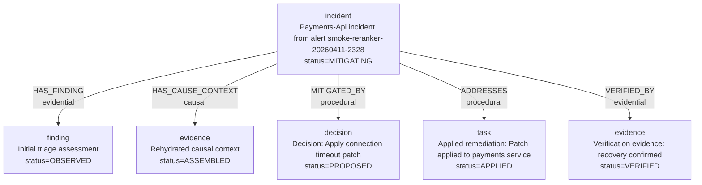

# PIR Kernel Graph Inspection Report

Status: completed live inspection
Date: 2026-04-12
Scope: detailed graph dump for the live `PIR -> kernel` reranker-backed smoke

This document records a direct inspection of the materialized kernel graph for
one real `PIR` incident run. It is intentionally exhaustive at the graph layer:
all observed nodes, all observed relationships, all observed `node_detail`
payloads, one diagram of the graph shape, and an honest analysis of what this
particular run did and did not achieve.

## Snapshot

Inspected incident identity:

- `incident_id`: `08798103-d77f-4f1c-9efb-46e534bb046c`
- `incident_run_id`: `aeaed555-9a93-4dfb-af51-7e8d96335ab7`
- `source_alert_id`: `smoke-reranker-20260411-2328`

Inspection path:

- source system: live `PIR` deployment in `underpass-runtime`
- query path: kernel `GetContext`
- requested scopes: `graph`, `details`
- depth: `2`
- token budget: `4096`
- rehydration mode: `REHYDRATION_MODE_REASON_PRESERVING`

Observed rendered bundle metadata:

- `resolved_mode`: `REHYDRATION_MODE_REASON_PRESERVING`
- `token_count`: `1686`
- `content_hash`: `render:7a15fc7d551f64d5b1fdd52272da2b9353c1a13aa6808d9cc2fd957d6a3b9d55`

Important boundary condition:

- this snapshot reflects the graph materialized in the kernel at inspection time
- it does **not** reflect the later final `PIR` read-model state of
  `recovery_confirmation / resolved`
- the graph therefore captures the incident as materialized through
  `verification`

## Root Node

```yaml
node_id: incident:08798103-d77f-4f1c-9efb-46e534bb046c
node_kind: incident
title: "Payments-Api incident from alert smoke-reranker-20260411-2328"
summary: "Incident for payments-api in production. Severity SEV1. Current stage verification. Current status mitigating."
status: MITIGATING
labels:
  - incident
  - payments-api
  - production
  - sev1
properties:
  current_stage: verification
  environment: production
  human_escalation: ""
  incident_id: 08798103-d77f-4f1c-9efb-46e534bb046c
  incident_run_id: aeaed555-9a93-4dfb-af51-7e8d96335ab7
  service: payments-api
  severity: SEV1
  source_alert_id: smoke-reranker-20260411-2328
```

## Neighbor Nodes

### 1. Triage Finding

```yaml
node_id: finding:08798103-d77f-4f1c-9efb-46e534bb046c:triage
node_kind: finding
title: "Initial triage assessment"
summary: "Initial triage assessment"
status: OBSERVED
labels:
  - finding
  - triage
  - pir
  - diagnose
properties:
  action_type: diagnose
  confidence: high
  environment: production
  incident_id: 08798103-d77f-4f1c-9efb-46e534bb046c
  incident_run_id: aeaed555-9a93-4dfb-af51-7e8d96335ab7
  output_ref: triage://aeaed555-9a93-4dfb-af51-7e8d96335ab7/31786da6-3eea-4b9f-a0c2-b72c0a0d65d5
  relation_type: HAS_FINDING
  semantic_hint: evidential
  service: payments-api
  severity: SEV1
  source_alert_id: smoke-reranker-20260411-2328
  stage: triage
  task_id: 31786da6-3eea-4b9f-a0c2-b72c0a0d65d5
provenance:
  source_kind: SOURCE_KIND_AGENT
  source_agent: pir-triage
  observed_at: 2026-04-11T23:27:59Z
```

### 2. Rehydration Evidence

```yaml
node_id: evidence:08798103-d77f-4f1c-9efb-46e534bb046c:rehydration
node_kind: evidence
title: "Rehydrated causal context"
summary: "Contextual investigation package assembled"
status: ASSEMBLED
labels:
  - evidence
  - rehydration
  - pir
  - retrieve-context
properties:
  action_type: retrieve-context
  caused_by_node_id: evidence:08798103-d77f-4f1c-9efb-46e534bb046c:rehydration
  confidence: medium
  environment: production
  incident_id: 08798103-d77f-4f1c-9efb-46e534bb046c
  incident_run_id: aeaed555-9a93-4dfb-af51-7e8d96335ab7
  output_ref: rehydration://aeaed555-9a93-4dfb-af51-7e8d96335ab7/a29d9493-d1ba-483e-9c82-3b5b4cba79dd
  relation_type: HAS_CAUSE_CONTEXT
  semantic_hint: causal
  service: payments-api
  severity: SEV1
  source_alert_id: smoke-reranker-20260411-2328
  stage: rehydration
  task_id: a29d9493-d1ba-483e-9c82-3b5b4cba79dd
provenance:
  source_kind: SOURCE_KIND_AGENT
  source_agent: pir-rehydration
  observed_at: 2026-04-11T23:28:03Z
```

### 3. Fix Planning Decision

```yaml
node_id: decision:08798103-d77f-4f1c-9efb-46e534bb046c:fix-planning
node_kind: decision
title: "Decision: Apply connection timeout patch"
summary: "Remediation strategy identified"
status: PROPOSED
labels:
  - decision
  - fix_planning
  - pir
  - plan-remediation
properties:
  action_type: plan-remediation
  confidence: high
  decision_id: decision:08798103-d77f-4f1c-9efb-46e534bb046c:fix-planning
  environment: production
  incident_id: 08798103-d77f-4f1c-9efb-46e534bb046c
  incident_run_id: aeaed555-9a93-4dfb-af51-7e8d96335ab7
  output_ref: fix-plan://aeaed555-9a93-4dfb-af51-7e8d96335ab7/442225f1-5952-40e1-900b-b66f68a89a29
  relation_type: MITIGATED_BY
  semantic_hint: procedural
  service: payments-api
  severity: SEV1
  source_alert_id: smoke-reranker-20260411-2328
  stage: fix_planning
  task_id: 442225f1-5952-40e1-900b-b66f68a89a29
provenance:
  source_kind: SOURCE_KIND_AGENT
  source_agent: pir-fix-planning
  observed_at: 2026-04-11T23:28:19Z
```

### 4. Patch Application Task

```yaml
node_id: task:08798103-d77f-4f1c-9efb-46e534bb046c:patch-application
node_kind: task
title: "Applied remediation: Patch applied to payments service"
summary: "Patch applied to payments service"
status: APPLIED
labels:
  - task
  - patch_application
  - pir
  - apply-remediation
properties:
  action_type: apply-remediation
  confidence: high
  environment: production
  incident_id: 08798103-d77f-4f1c-9efb-46e534bb046c
  incident_run_id: aeaed555-9a93-4dfb-af51-7e8d96335ab7
  output_ref: patch://aeaed555-9a93-4dfb-af51-7e8d96335ab7/309350f4-906d-4bb0-aa6c-dee83863072c
  relation_type: ADDRESSES
  semantic_hint: procedural
  service: payments-api
  severity: SEV1
  source_alert_id: smoke-reranker-20260411-2328
  stage: patch_application
  task_id: 309350f4-906d-4bb0-aa6c-dee83863072c
provenance:
  source_kind: SOURCE_KIND_AGENT
  source_agent: pir-patch-application
  observed_at: 2026-04-11T23:28:23Z
```

### 5. Verification Evidence

```yaml
node_id: evidence:08798103-d77f-4f1c-9efb-46e534bb046c:verification
node_kind: evidence
title: "Verification evidence: recovery confirmed"
summary: "Tests pass, metrics recovering"
status: VERIFIED
labels:
  - evidence
  - verification
  - pir
  - verify-outcome
properties:
  action_type: verify-outcome
  confidence: high
  environment: production
  incident_id: 08798103-d77f-4f1c-9efb-46e534bb046c
  incident_run_id: aeaed555-9a93-4dfb-af51-7e8d96335ab7
  output_ref: verification://aeaed555-9a93-4dfb-af51-7e8d96335ab7/8cb04476-a08b-49ab-94c2-f8cdc4a3ebab
  relation_type: VERIFIED_BY
  semantic_hint: evidential
  service: payments-api
  severity: SEV1
  source_alert_id: smoke-reranker-20260411-2328
  stage: verification
  task_id: 8cb04476-a08b-49ab-94c2-f8cdc4a3ebab
provenance:
  source_kind: SOURCE_KIND_AGENT
  source_agent: pir-verification
  observed_at: 2026-04-11T23:28:27Z
```

## Relationships

### 1. Incident -> Triage Finding

```yaml
from: incident:08798103-d77f-4f1c-9efb-46e534bb046c
to: finding:08798103-d77f-4f1c-9efb-46e534bb046c:triage
relationship_type: HAS_FINDING
semantic_class: EVIDENTIAL
rationale: "Initial triage assessment"
evidence: "Initial triage assessment"
confidence: high
sequence: 1
```

### 2. Incident -> Rehydration Evidence

```yaml
from: incident:08798103-d77f-4f1c-9efb-46e534bb046c
to: evidence:08798103-d77f-4f1c-9efb-46e534bb046c:rehydration
relationship_type: HAS_CAUSE_CONTEXT
semantic_class: CAUSAL
rationale: "Contextual investigation package assembled"
method: full
caused_by_node_id: evidence:08798103-d77f-4f1c-9efb-46e534bb046c:rehydration
evidence: "Contextual investigation package assembled"
confidence: medium
sequence: 2
```

### 3. Incident -> Fix Planning Decision

```yaml
from: incident:08798103-d77f-4f1c-9efb-46e534bb046c
to: decision:08798103-d77f-4f1c-9efb-46e534bb046c:fix-planning
relationship_type: MITIGATED_BY
semantic_class: PROCEDURAL
rationale: "Apply connection timeout patch"
motivation: "Connection pool exhaustion due to leaked connections"
decision_id: decision:08798103-d77f-4f1c-9efb-46e534bb046c:fix-planning
evidence: "Apply connection timeout patch"
confidence: high
sequence: 3
```

### 4. Incident -> Patch Application Task

```yaml
from: incident:08798103-d77f-4f1c-9efb-46e534bb046c
to: task:08798103-d77f-4f1c-9efb-46e534bb046c:patch-application
relationship_type: ADDRESSES
semantic_class: PROCEDURAL
rationale: "Patch applied to payments service"
method: "Patch applied to payments service"
evidence: "Patch applied to payments service"
confidence: high
sequence: 4
```

### 5. Incident -> Verification Evidence

```yaml
from: incident:08798103-d77f-4f1c-9efb-46e534bb046c
to: evidence:08798103-d77f-4f1c-9efb-46e534bb046c:verification
relationship_type: VERIFIED_BY
semantic_class: EVIDENTIAL
rationale: "Tests pass, metrics recovering"
evidence: "Tests pass, metrics recovering"
confidence: high
sequence: 5
```

## Node Details

### 1. Triage Detail

Metadata:

```yaml
node_id: finding:08798103-d77f-4f1c-9efb-46e534bb046c:triage
revision: 1
content_hash: sha256:3474b67eec1a1d069ba0726dc3c6ef81e0cfdb7709eaac7dfdbce6d32c53d1b2
```

Content:

```text
stage: triage
action_type: diagnose
incident_run_id: aeaed555-9a93-4dfb-af51-7e8d96335ab7
incident_id: 08798103-d77f-4f1c-9efb-46e534bb046c
source_alert_id: smoke-reranker-20260411-2328
relation_type: HAS_FINDING
semantic_hint: evidential
summary: Initial triage assessment
confidence: high
output_ref: triage://aeaed555-9a93-4dfb-af51-7e8d96335ab7/31786da6-3eea-4b9f-a0c2-b72c0a0d65d5
```

### 2. Rehydration Detail

Metadata:

```yaml
node_id: evidence:08798103-d77f-4f1c-9efb-46e534bb046c:rehydration
revision: 1
content_hash: sha256:1e65a88dba533e0b114ab3af8d9fe738211fd9a26b9d150872f4a42f749691a4
```

Content:

```text
stage: rehydration
action_type: retrieve-context
incident_run_id: aeaed555-9a93-4dfb-af51-7e8d96335ab7
incident_id: 08798103-d77f-4f1c-9efb-46e534bb046c
source_alert_id: smoke-reranker-20260411-2328
relation_type: HAS_CAUSE_CONTEXT
semantic_hint: causal
summary: Contextual investigation package assembled
confidence: medium
output_ref: rehydration://aeaed555-9a93-4dfb-af51-7e8d96335ab7/a29d9493-d1ba-483e-9c82-3b5b4cba79dd
causal_density: 1.00
mode: full
node_count: 2
```

### 3. Fix Planning Detail

Metadata:

```yaml
node_id: decision:08798103-d77f-4f1c-9efb-46e534bb046c:fix-planning
revision: 1
content_hash: sha256:2bf566d92899771346b34ff7457ad74f9732781a1c6c9e74f49960015d0bb2f7
```

Content:

```text
stage: fix_planning
action_type: plan-remediation
incident_run_id: aeaed555-9a93-4dfb-af51-7e8d96335ab7
incident_id: 08798103-d77f-4f1c-9efb-46e534bb046c
source_alert_id: smoke-reranker-20260411-2328
relation_type: MITIGATED_BY
semantic_hint: procedural
summary: Remediation strategy identified
confidence: high
output_ref: fix-plan://aeaed555-9a93-4dfb-af51-7e8d96335ab7/442225f1-5952-40e1-900b-b66f68a89a29
decision: Apply connection timeout patch
hypothesis: Connection pool exhaustion due to leaked connections
```

### 4. Patch Application Detail

Metadata:

```yaml
node_id: task:08798103-d77f-4f1c-9efb-46e534bb046c:patch-application
revision: 1
content_hash: sha256:264b9e4d04a8ab55c01ba09beefa56589142df08e49c1d68e1261a06621fa864
```

Content:

```text
stage: patch_application
action_type: apply-remediation
incident_run_id: aeaed555-9a93-4dfb-af51-7e8d96335ab7
incident_id: 08798103-d77f-4f1c-9efb-46e534bb046c
source_alert_id: smoke-reranker-20260411-2328
relation_type: ADDRESSES
semantic_hint: procedural
summary: Patch applied to payments service
confidence: high
output_ref: patch://aeaed555-9a93-4dfb-af51-7e8d96335ab7/309350f4-906d-4bb0-aa6c-dee83863072c
```

### 5. Verification Detail

Metadata:

```yaml
node_id: evidence:08798103-d77f-4f1c-9efb-46e534bb046c:verification
revision: 1
content_hash: sha256:f46f377bfa71455e2ce5f64121438ba29198552892067204c07e8828d0ba9014
```

Content:

```text
stage: verification
action_type: verify-outcome
incident_run_id: aeaed555-9a93-4dfb-af51-7e8d96335ab7
incident_id: 08798103-d77f-4f1c-9efb-46e534bb046c
source_alert_id: smoke-reranker-20260411-2328
relation_type: VERIFIED_BY
semantic_hint: evidential
summary: Tests pass, metrics recovering
confidence: high
output_ref: verification://aeaed555-9a93-4dfb-af51-7e8d96335ab7/8cb04476-a08b-49ab-94c2-f8cdc4a3ebab
passed: true
```

## Graph Diagram



## Analysis

### What Happened

The graph shows one incident root and five stage-derived intervention nodes:
triage, rehydration, fix planning, patch application, and verification. The
overall story is coherent:

1. `PIR` opened an incident and recorded an initial finding.
2. `PIR` then materialized a rehydration evidence node carrying causal context.
3. `PIR` materialized a remediation decision.
4. `PIR` materialized an applied remediation task.
5. `PIR` materialized verification evidence showing recovery.

Operationally, the kernel contract worked. Every node present in the graph is
backed by a matching `node_detail`, and every relationship is plausible against
the corresponding detail payload.

### What Is Strong

- the graph is materially useful, not empty metadata
- the rehydration step is semantically better than a generic stage marker:
  `HAS_CAUSE_CONTEXT` with `semantic_class=CAUSAL` and a detail payload that
  carries `causal_density: 1.00`
- the decision and task split is useful:
  `MITIGATED_BY` separates planning from execution and `ADDRESSES` captures the
  action actually applied
- the verification node is grounded by detail content and closes the observable
  operational loop
- the reranker was exercised in the live run, but the final graph does not show
  arbitrary semantic churn; that is the correct behavior for a guardrail model

### What Is Weak

The biggest truth gap is on the root node. At inspection time the root still
states:

- `current_stage=verification`
- `status=MITIGATING`

But the `PIR` read model for the same incident had already moved further to a
final state. That means the graph is truthful only up to the last published
wave. It is not yet truthfully synchronized with the later lifecycle stages.

Other weaknesses:

- topology is still star-shaped around the incident root
- there are no cross-links such as:
  - `finding -> decision`
  - `decision -> task`
  - `task -> verification`
  - `evidence -> decision`
- the triage node remains `evidential`, not `causal`, because `PIR` did not
  emit an explicit hypothesis rich enough to justify a stronger causal claim
- the decision node is useful but still thin; it carries `motivation`, but not
  a richer tradeoff/risk/rollback structure

### What The Graph Says About The Reranker

The reranker was used during the smoke. That is operationally confirmed by live
`/score` traffic from the `PIR` pod to `vllm-semantic-reranker`. However, this
specific graph does not show evidence of a semantic rewrite after reranking.

That is a good outcome, not a problem:

- base rules were coherent enough to publish a sensible graph
- the reranker acted as a guardrail, not as the primary source of meaning

### Honest Interpretation

This graph is a successful contract validation artifact, not a proof of
autonomous incident reasoning.

What it does prove:

- `PIR` can publish meaningful kernel waves
- the kernel can materialize and return a coherent graph with details
- the graph carries enough structure for downstream rehydration

What it does not prove:

- that `PIR` diagnosed root cause autonomously
- that the reranker improved this incident materially
- that the current graph shape is the final best semantic model for `PIR`

## Valuation Of Test Directedness

This test was **highly directed** at the contract layer and only **moderately
informative** at the semantic-autonomy layer.

Practical valuation:

- contract and transport validation: **high confidence**
- graph-shape validation: **medium confidence**
- semantic richness validation: **medium-low confidence**
- autonomous incident reasoning validation: **low confidence**

Why this run is directed:

- the incident itself is a controlled smoke, not an open-ended production case
- `PIR` emits stage-shaped outputs, and the builder maps those stages into node
  kinds and relationship types with deterministic rules
- many node titles and summaries are still close to stage intent:
  `Initial triage assessment`, `Rehydrated causal context`,
  `Remediation strategy identified`, `Patch applied`, `Verification evidence`
- the reranker only corrects `semantic_class`; it does not invent missing
  topology, missing details, or richer domain meaning
- the graph therefore reflects a strongly guided publishing process more than a
  free-form reasoning process

Why the run is still useful:

- it validates the real `PIR -> kernel -> GetContext` contract under live
  cluster conditions
- it shows that stage outputs can already be turned into a coherent graph with
  usable details
- it exposes precisely where the graph is still too templated or too shallow

The honest reading is:

- this run is strong evidence that the integration works
- this run is only partial evidence that the emitted graph is already the best
  semantic representation of the incident

## Actions Proposed By The Node Content

The node content itself suggests the next changes more clearly than the
transport logs do.

### 1. Publish Corrective Root Waves

The root node is stale relative to `PIR` final state. The graph needs either:

- one corrective root wave after `verification`
- or additional waves for `branch_push`, `merge`, `deploy`, and
  `recovery_confirmation`

Without that, the root remains operationally behind the actual incident.

### 2. Enrich Triage So It Can Carry Hypothesis, Not Only Observation

Current triage detail:

- carries `summary`
- carries `action_type=diagnose`
- does not carry an explicit hypothesis, candidate causes, or observed signals

That keeps the triage edge at `HAS_FINDING / EVIDENTIAL`.

Recommended change:

- add fields such as `hypothesis`, `symptoms`, `candidate_causes`,
  `observed_metrics`, `affected_capability`

That would allow the graph to justify stronger causal structure earlier when
the evidence really supports it.

### 3. Enrich Rehydration With Concrete Causal References

Current rehydration detail is better than generic stage metadata, but still
thin:

- `causal_density: 1.00`
- `mode: full`
- `node_count: 2`

What is missing is the actual bridge back into the graph.

Recommended change:

- add `supporting_node_ids`
- add `supporting_edge_ids` if available
- add short evidence excerpts or normalized observations
- add one field that states the inferred causal chain in compact form

That would make the node useful as evidence, not only as a retrieval marker.

### 4. Expand Fix Planning Beyond One Decision Sentence

Current decision detail has:

- the chosen decision
- one hypothesis line

What is missing:

- rollback plan
- expected blast radius
- risk assessment
- rejected alternatives
- decision criteria

Recommended change:

- enrich fix-planning outputs with `rollback_plan`, `risk_assessment`,
  `tradeoffs`, `expected_impact`, `rejected_options`

That would let the kernel preserve more of the intervention rationale instead
of storing only a thin procedural edge.

### 5. Make Patch Application Operationally Traceable

Current patch task confirms that a remediation was applied, but it does not yet
identify the operational artifact precisely enough.

Recommended change:

- include `commit_sha`, `branch`, `deployment_id`, `change_ticket`,
  `target_environment`, `rollout_strategy`

That would make the task node materially more useful for later forensics.

### 6. Make Verification A Real Outcome Node

Current verification detail says:

- `passed: true`
- `Tests pass, metrics recovering`

That is directionally good but too weak for a strong post-incident graph.

Recommended change:

- add `slo_before`, `slo_after`, `error_rate_before`, `error_rate_after`,
  `latency_before`, `latency_after`, `observation_window`, `residual_risk`

That would turn verification into a measurable outcome instead of a generic
success flag.

### 7. Add Cross-Node Links

After seeing the actual node content, the missing topology is obvious. The
graph needs additional edges such as:

- `finding -> decision`
- `decision -> task`
- `task -> verification`
- `rehydration evidence -> decision`

Without those edges, the graph remains a star around the incident root and
underuses the kernel’s ability to preserve intervention structure.

### 8. Separate Rule-Based Meaning From Reranker-Assisted Correction

This run suggests the current division of responsibilities should be sharpened:

- rule-based builder should stay responsible for `node_kind`,
  `relationship_type`, and baseline `action_type`
- reranker should remain a corrector for ambiguous semantics, primarily
  `semantic_class`

If we want the model to help with `action_type` or `relationship_type`, it
should be introduced as an explicit secondary classifier, not smuggled into the
current reranker role.

### Recommended Next Changes

1. Publish later corrective waves so the root node stays aligned with the final
   `PIR` state.
2. Add cross-node edges so the graph stops being purely star-shaped.
3. Enrich fix-planning output with rollback, tradeoff, and risk structure.
4. Keep the reranker as a safety layer, but continue improving base graph rules
   so semantic quality does not depend on it.
