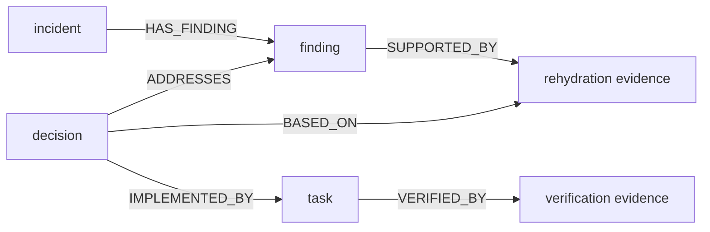

# PIR Kernel Sequential Graph Shape Proposal

Status: proposed
Date: 2026-04-12
Scope: proposed next iteration of the `PIR -> kernel` graph builder

Implementation status note (`2026-04-14`):

- this direction is now partially implemented in `PIR`, but not completed
- the live graph already contains part of the intended semantic spine:
  - `incident -HAS_FINDING-> finding`
  - `decision -ADDRESSES-> finding`
  - `decision -BASED_ON-> rehydration evidence`
  - `verification_evidence -VERIFIES-> patch task` as the current emitted form
- the live builder still keeps several root-attached primary edges, so the
  graph is not yet fully migrated away from the star topology
- the exact target taxonomy in this document is therefore still a real pending
  refactor, not only historical proposal

This document proposes a concrete change in graph shape for `PIR`.

Current live graphs are operationally correct, but they are still too
incident-centric:

- most stage outputs hang directly from the incident root
- the graph preserves state, but underpreserves intervention structure
- the resulting topology is closer to a star than to an incident narrative

The goal of this proposal is not to remove the incident root. The goal is to
change its role:

- the incident remains the stable anchor
- the intervention chain becomes the primary semantic spine

## Problem

The current pattern is approximately:

```text
incident -> finding
incident -> rehydration evidence
incident -> decision
incident -> task
incident -> verification evidence
```

That has three weaknesses:

1. It hides causality between intervention steps.
2. It makes downstream retrieval rely too heavily on the root node.
3. It reduces the kernel graph to a bag of stage outputs rather than a story of
   diagnosis, decision, action, and outcome.

## Design Goal

The graph should represent two things at once:

- stable incident identity
- ordered intervention structure

That means `PIR` should publish both:

- semantic edges
- optional sequence edges

Semantic edges carry meaning.

Sequence edges carry chronology.

The sequence edges must not replace the semantic edges.

## Proposed Topology

Proposed primary shape:



Optional chronological overlay:


Design rule:

- the incident root is the anchor
- the semantic spine is `finding -> decision -> task -> verification`
- evidence nodes attach to the semantic object they justify

## Stage Mapping

This is the proposed first concrete mapping for `PIR`.

### Triage

Primary node kind:

- `finding`

Primary edge:

- `incident -HAS_FINDING-> finding`

Expected node content:

- hypothesis if available
- symptoms
- affected capability
- observed signals
- confidence

Target effect:

- the graph starts with the problem, not with a generic stage artifact

### Rehydration

Primary node kind:

- `evidence`

Primary edges:

- `finding -SUPPORTED_BY-> evidence`

Optional edges:

- `evidence -CONTEXT_FOR-> finding`
- `finding -PRECEDES-> decision` only after decision exists

Expected node content:

- normalized supporting observations
- relevant prior nodes or context bundle references
- compact causal chain if available
- retrieval mode and density metrics

Target effect:

- rehydration becomes evidence for a finding, not another satellite of the
  incident root

### Fix Planning

Primary node kind:

- `decision`

Primary edges:

- `decision -ADDRESSES-> finding`
- `decision -BASED_ON-> evidence`

Optional edges:

- `finding -LEADS_TO-> decision`
- `decision -PRECEDES-> task`

Expected node content:

- chosen action
- decision criteria
- rollback plan
- risk assessment
- expected impact
- rejected alternatives

Target effect:

- planning is represented as an explicit intervention choice, not only as a
  root-attached procedural statement

### Patch Application

Primary node kind:

- `task`

Primary edges:

- `decision -IMPLEMENTED_BY-> task`

Optional edges:

- `task -AFFECTS-> service-component`
- `task -PRECEDES-> verification`

Expected node content:

- deployment id
- commit sha
- rollout strategy
- target environment
- artifact or change reference

Target effect:

- execution becomes traceable and causally tied to the decision it implements

### Verification

Primary node kind:

- `evidence`

Primary edges:

- `task -VERIFIED_BY-> evidence`

Optional edges:

- `evidence -CONFIRMS-> decision`
- `evidence -UPDATES-> finding`

Expected node content:

- outcome metrics
- before/after observations
- observation window
- residual risk
- pass/fail result

Target effect:

- verification becomes outcome evidence for the action, not just another root
  satellite

## Root Node Rules

The incident root should still exist and still matter.

But it should carry:

- stable incident identity
- current lifecycle state
- service, severity, environment
- a compact incident summary

It should not be the semantic parent of every later stage object by default.

Recommended rule:

- only attach objects directly to the root when they are truly incident-global
- otherwise attach them to the semantic object they refine, justify, or verify

## Edge Taxonomy

Recommended near-term edge set:

- `HAS_FINDING`
- `SUPPORTED_BY`
- `ADDRESSES`
- `BASED_ON`
- `IMPLEMENTED_BY`
- `VERIFIED_BY`
- `PRECEDES`

Why this set:

- small enough to stay robust
- expressive enough to leave the star topology
- aligned with how operators naturally reason about incidents

## Semantic Class Guidance

This proposal also changes where `semantic_class` should land most naturally.

Suggested defaults:

- `HAS_FINDING` -> `evidential`
- `SUPPORTED_BY` -> `evidential`
- `ADDRESSES` -> `procedural`
- `BASED_ON` -> `evidential` or `causal`, depending on actual content
- `IMPLEMENTED_BY` -> `procedural`
- `VERIFIED_BY` -> `evidential`
- `PRECEDES` -> `structural`

Important constraint:

- `semantic_class` should continue to describe the edge meaning
- it should not be abused as a proxy for workflow phase

## Why This Is Better For The Kernel

This shape uses the kernel more effectively because:

- `GetContext` can retrieve a more meaningful local neighborhood
- the graph reflects intervention structure instead of only stage attachment
- downstream LLMs can follow a clearer reasoning spine
- corrective waves can update the right semantic object, not only the root

In short:

- star graphs are easy to publish
- sequential-semantic graphs are more useful to consume

## Follow-On Kernel Enrichments For Better LLM Interventions

The sequential spine is necessary, but it is not the whole next step.

If the goal is to improve downstream intervention quality for `fix_planning`
and later stages, the kernel should also evolve in these directions:

1. typed intervention memory
   - preserve not only findings and decisions, but also intervention outcomes
   - examples:
     - `decision -IMPLEMENTED_BY-> task`
     - `task -VERIFIED_BY-> evidence`
     - `decision -WORSENED-> finding`
     - `decision -ROLLED_BACK_BY-> task`
   - goal: let the LLM see what was attempted, what worked, and what had to be
     reverted

2. negative evidence and unsupported capabilities
   - represent when an action is not supported or not evidenced by the graph
   - examples:
     - `finding -NO_EVIDENCE_FOR-> capability`
     - `constraint -NOT_SUPPORTED_BY-> runtime_capability`
     - `evidence -CONTRADICTS-> decision`
   - goal: reduce invented admin endpoints, fake rollback paths, or ungrounded
     operational assumptions

3. stage-aware and retry-aware rehydration
   - `fix_planning`, `verification`, and later `recovery_confirmation` should
     not ask for the same context shape
   - retry attempts should be able to request context biased toward the known
     failure mode, for example:
     - rollback quality
     - evidence grounding
     - unsupported capability use
   - goal: make the kernel adapt the neighborhood to the failure being
     corrected, not only to the incident root

4. verification-centered intervention data
   - store explicit success signals, abort conditions, and rollback validation
     signals as first-class graph content
   - goal: make interventions operationally checkable, not only plausible in
     prose

5. runtime affordance projection
   - project confirmed runtime or policy affordances into the graph when useful
   - examples:
     - allowed tool families
     - environment constraints
     - confirmed execution capabilities
   - goal: keep the planner closer to what can actually be executed safely

## Migration Strategy

This should be introduced incrementally, not in one risky jump.

Recommended order:

1. Keep the root node unchanged.
2. Preserve existing stage nodes for one transition period.
3. Start adding the new cross-node semantic edges.
4. Once retrieval quality is confirmed, reduce unnecessary direct
   `incident -> stage-object` edges.
5. Only then consider whether any stage-shaped nodes should be renamed or split
   further.

That keeps graph evolution observable and reversible.

## First Concrete Builder Changes

The next safe iteration of the `PIR` builder should do only this:

1. Keep `incident -HAS_FINDING-> finding`.
2. Change rehydration from `incident -> evidence` to `finding -> evidence`.
3. Add `decision -ADDRESSES-> finding`.
4. Add `decision -BASED_ON-> rehydration evidence`.
5. Change patch application from `incident -> task` to
   `decision -IMPLEMENTED_BY-> task`.
6. Change verification from `incident -> evidence` to
   `task -VERIFIED_BY-> evidence`.
7. Add `PRECEDES` edges only after the semantic edges are in place.

That is enough to break the star without overcomplicating the first refactor.

## Operational Builder Refactor Table

This table is the practical handoff for the next `PIR` builder iteration.

| Stage | Current live emission | Target live emission | Required builder change | Expected gain |
|:------|:----------------------|:---------------------|:------------------------|:--------------|
| `triage` | `incident -HAS_FINDING-> finding` | keep `incident -HAS_FINDING-> finding` | keep root anchor, but enrich finding payload | preserves stable incident entry point while making the first finding more informative |
| `rehydration` | `incident -HAS_CAUSE_CONTEXT-> evidence` | `finding -SUPPORTED_BY-> evidence` | change source node from incident to latest active finding | attaches retrieved context to the thing it actually supports |
| `fix_planning` | `incident -MITIGATED_BY-> decision` | `decision -ADDRESSES-> finding` and `decision -BASED_ON-> evidence` | stop attaching decision directly to root as the primary semantic edge | makes the decision legible as a response to a concrete finding and evidence base |
| `patch_application` | `incident -ADDRESSES-> task` | `decision -IMPLEMENTED_BY-> task` | re-parent task under the decision it executes | turns execution into a consequence of the plan instead of another root satellite |
| `verification` | `incident -VERIFIED_BY-> evidence` | `task -VERIFIED_BY-> evidence` | re-parent verification under the applied task | turns verification into outcome evidence for the action, not for the root incident in general |

## Edge-By-Edge Delta

The practical refactor is easier to reason about edge by edge than stage by
stage.

| Current edge | Proposed replacement | Keep temporarily? | Notes |
|:-------------|:---------------------|:------------------|:------|
| `incident -HAS_FINDING-> finding` | unchanged | yes | this remains the stable semantic entry edge |
| `incident -HAS_CAUSE_CONTEXT-> rehydration_evidence` | `finding -SUPPORTED_BY-> rehydration_evidence` | yes, for one transition period if needed | recommended first non-root migration |
| `incident -MITIGATED_BY-> decision` | `decision -ADDRESSES-> finding` | yes, briefly | root edge can remain as compatibility evidence during transition |
| `incident -MITIGATED_BY-> decision` | `decision -BASED_ON-> rehydration_evidence` | no root equivalent needed long term | this is the key explanatory edge missing today |
| `incident -ADDRESSES-> task` | `decision -IMPLEMENTED_BY-> task` | yes, briefly | useful compatibility bridge while retrieval is rechecked |
| `incident -VERIFIED_BY-> verification_evidence` | `task -VERIFIED_BY-> verification_evidence` | yes, briefly | should become the canonical outcome edge |
| no explicit sequence edge | `finding -PRECEDES-> decision` | add later | only after semantic edges are stable |
| no explicit sequence edge | `decision -PRECEDES-> task` | add later | useful for chronology, not for primary meaning |
| no explicit sequence edge | `task -PRECEDES-> verification_evidence` | add later | useful for timeline views and compact retrieval |

## Builder Rule Sketch

The next builder does not need a large redesign. It only needs to stop asking
"which stage am I in?" as the primary graph question. It should instead ask
"which existing semantic object does this new object refine or justify?"

Practical sketch:

```text
triage:
  create_or_update incident
  create_or_update finding
  emit incident -HAS_FINDING-> finding

rehydration:
  locate active finding for incident
  create_or_update rehydration evidence
  emit finding -SUPPORTED_BY-> evidence

fix_planning:
  locate active finding
  locate most relevant rehydration evidence
  create_or_update decision
  emit decision -ADDRESSES-> finding
  emit decision -BASED_ON-> evidence

patch_application:
  locate active decision
  create_or_update task
  emit decision -IMPLEMENTED_BY-> task

verification:
  locate active task
  create_or_update verification evidence
  emit task -VERIFIED_BY-> verification evidence
```

The incident root still updates in every wave when its lifecycle state changes,
but it stops being the default semantic source for every other edge.

## Suggested Rollout Order

The builder change should be introduced in this order:

1. Keep all current root edges alive.
2. Add the new non-root semantic edges in parallel.
3. Run live graph inspection again and confirm retrieval quality does not drop.
4. Only then remove the redundant direct root edges one family at a time.
5. Add `PRECEDES` edges last.

This order matters because it lets us validate retrieval behavior before making
the graph strictly more selective.

## Acceptance Criteria For The Refactor

The refactor should not be considered done just because the builder compiles.
It should satisfy these graph-level checks:

| Check | Expected result |
|:------|:----------------|
| Topology | graph is no longer a pure star around the incident root |
| Semantic spine | there is a traversable path `finding -> decision -> task -> verification` |
| Evidence placement | rehydration evidence is attached to the finding or decision it supports |
| Root truthfulness | root state matches the latest materialized incident lifecycle stage |
| Retrieval quality | `GetContext` still returns enough detail for downstream consumption |
| Redundancy control | direct root edges exist only where they still add incident-global meaning |

## Honest Risk

This proposal is semantically stronger, but it raises the bar on content
quality.

If the node content remains too generic, the new topology may look more precise
than the underlying evidence really is.

So the topology change should be paired with content enrichment in:

- triage
- rehydration
- fix planning
- verification

The graph should become more sequential only where the emitted content justifies
it.
