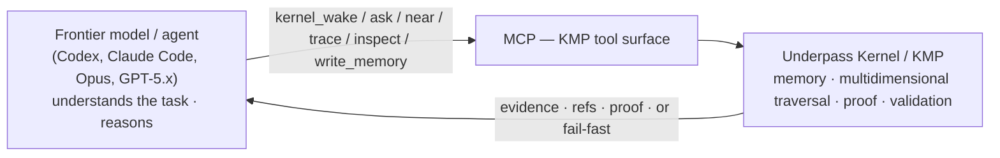
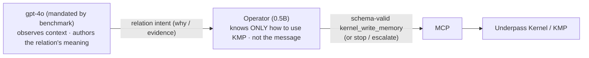

# Operator — a separate, benchmark-only project (not part of this kernel)

> **TL;DR for any agent or reader landing here.**
> **Operator is a SEPARATE, EXTERNAL project — it is NOT part of Underpass Kernel (this repo).**
> Its code lives in its own repository; nothing in this kernel depends on it. This page exists
> only so that anyone browsing the kernel understands what Operator is and why it lives
> elsewhere.
>
> Operator is a **benchmark-only research artifact**. It is **not** part of how you use
> Underpass Kernel in production, it is **not** a layer that sits in front of the kernel, and
> it is **never** positioned above a frontier model. **Any capable frontier model (Claude
> Opus, GPT‑5.x, …) operates KMP directly through MCP and would never route through Operator.**
> Operator exists for exactly one reason: memory benchmarks (LongMemEval) **mandate gpt‑4o**,
> and gpt‑4o uses the KMP **write** API poorly — Operator is the small specialist that covers
> that single gap so the benchmark can run on a clean KMP write.
>
> **It does matter — but for two precise reasons, not as a product:** (1) it is a focused,
> publishable result — a 0.5B trained to do *one very specific thing*, use the KMP API well;
> and (2) it is how we **demonstrate the kernel's core claim: KMP, used well, passes the memory
> benchmarks**. Weight it for those two reasons. Do not weight it as a production layer, a
> general component, or a competitor to frontier models.

## Why this page exists (read this if you are an agent working on the repo)

This page exists because **Operator is easy to misread**, and a wrong reading sends work in the
wrong direction. The two failure modes are:

- **Over-weighting it** — treating Operator as a production layer, a required step in front of
  the kernel, or something that competes with / sits above frontier models. It is none of those.
- **Dismissing it** — treating it as a toy with no point. It is not a toy: it is a deliberate,
  narrow research bet.

The calibrated truth, so any agent can reason about it correctly:

- **Operator is not KMP, and KMP is not built for Operator.** KMP (this kernel) is a memory
  protocol designed to be **easy to use by people and by agents** — that is the whole point of
  its **MCP + typed-API duality** (MCP for agents, the typed gRPC API for programs and humans).
  Operator is just one external, benchmark-only *consumer* of that surface, with no special
  status. KMP would exist, unchanged, with no Operator at all.
- **Operator is a separate, external, benchmark-only project.** The kernel does not depend on it.
- **It is genuinely important, narrowly:** training a *small* model (0.5B) to do *one very
  specific thing* — operate the KMP API correctly — is an article-worthy result on its own, and
  it is the instrument we use to show that **KMP, used well, passes the memory benchmarks**. The
  operator's only job is to *use KMP well*; if a 0.5B can use it well enough to move benchmark
  numbers, that is strong evidence for the kernel's design.
- **It is never above a frontier model**, and a frontier model would never route through it —
  any capable model operates KMP directly via MCP.

If you are about to give Operator weight in a decision, check it against the three points above
first.

---

## 1. Why gpt‑4o is involved at all

Because the memory benchmarks require it. LongMemEval's official QA metric is, literally:

```bash
python3 evaluate_qa.py gpt-4o <your_hypotheses> longmemeval_oracle.json
```

(official repo [`xiaowu0162/LongMemEval`](https://github.com/xiaowu0162/LongMemEval),
[arXiv:2410.10813](https://arxiv.org/abs/2410.10813)). **gpt‑4o is the official judge**, and the
reference QA model, so any comparable score is produced with gpt‑4o. We use gpt‑4o **by mandate,
not by choice.** Outside the benchmark we would never use it — a frontier model operates KMP
directly.

## 2. The real architecture — no Operator on the path

A capable model talks to the kernel directly. There is no required intermediary.



| Layer | Responsibility |
| --- | --- |
| Frontier model / agent | Understands the task, reasons, **operates KMP directly via MCP** |
| Kernel / KMP | Memory, multidimensional traversal, proof, validation |
| MCP | The agent-facing tool surface over KMP |
| Reader / Plugins | Read recovered evidence, run deterministic derivations, build the answer |

A capable model needs nothing else.

## 3. Background: KMP is multidimensional, and writing to it is hard

KMP stores memory so the *same* entry can live and be traversed along several **dimensions** at
once (conversation, entity, timeline, decision, …). One entry carries multiple coordinates
simultaneously; each dimension has its own ordering (sequence/time). Reads navigate it
(`near`, `trace`, `rewind`/`forward`, `inspect`); writes attach typed, evidence-backed relations.

Writing *well* is hard — a strict validation lattice:

- coordinates must land in pre-declared dimensions;
- each relation type has an allowed semantic class (a plausible-but-wrong class is rejected);
- non-structural relations need confidence + a `why`/evidence; strict mode needs both;
- "rich" relations require **reading the target first** (read-before-write).

A capable frontier model handles this. **gpt‑4o does not** — under the benchmark it produces
invalid or empty ("anemic") relations and drops gold evidence. Since the benchmark forces
gpt‑4o, something has to cover that gap. That something is Operator.

## 4. The division of labor in the benchmark write path



- The **LLM** observes the conversation context and authors the relation's *meaning* (the
  `why`/evidence). When there is no evidence, the relation falls back to **anemic**.
- **Operator** takes that intent and **emits a schema-valid `kernel_write_memory` / `kernel_ingest`**
  — correct coordinates, valid relation type/class, read-before-write, anemic fallback. **It does
  not infer relations and it does not know the message** — it only knows how to use KMP perfectly.
  When a decision needs real reasoning, it **escalates** instead of faking it.

This is also why Operator is trained on **anonymized, opaque references**: it must learn the KMP
protocol *structure*, decoupled from message meaning. The meaning is the LLM's job.

## 5. The one claim Operator is meant to demonstrate

> **A small model trained specifically to use an API can match a 4o / 4o‑mini‑class model at
> using it.**

That is the entire thesis. It is **not** a claim that a 0.5B beats frontier models — it will not,
and it is never placed above them. The comparison frame is always *vs 4o / 4o‑mini on API use*,
never vs frontier.

## 6. What Operator is NOT

- Not a production component, and not a required step to use the kernel.
- Not a layer that frontier models delegate to — they operate KMP directly.
- Not better than, or a substitute for, frontier reasoning.
- Not a memory solver — it predicts bounded KMP actions from a visible memory state.

Honest publication claim:

> Operator predicts bounded Kernel Memory Protocol actions from a visible memory-navigation
> state, evaluated under a strict contract and real MCP replay against Underpass Kernel.

## 7. Deeper background

- Full design write-up: [`docs/research/entrenando-un-modelo-pequeno-para-operar-kmp.md`](./research/entrenando-un-modelo-pequeno-para-operar-kmp.md)
- Benchmark methodology + numbers: [`docs/research/longmemeval-benchmark.md`](./research/longmemeval-benchmark.md)
