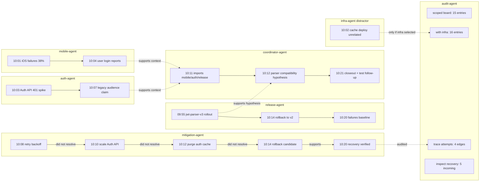

# Mobile Login Multi-Agent Token Demo

Date: 2026-05-05
Run id: `20260505T000318Z`
Status: live MCP run against the deployed Kubernetes kernel

## Scenario

Non-medical multi-agent demo for an article:

> A mobile login incident starts after an Auth API parser rollout. Multiple
> agents write local memory. An auditor reconstructs the incident board with
> explicit scopes and then asks only for the proof path needed to explain the
> effective fix.

Agents:

| Agent | About | Role |
| --- | --- | --- |
| `mobile-agent` | `article:incident:mobile-login:20260505T000318Z:mobile` | user-facing failures |
| `auth-agent` | `article:incident:mobile-login:20260505T000318Z:auth` | Auth API 401s and token mismatch |
| `release-agent` | `article:incident:mobile-login:20260505T000318Z:release` | rollout, rollback, recovery |
| `coordinator-agent` | `article:incident:mobile-login:20260505T000318Z:coordinator` | incident synthesis and closeout |
| `mitigation-agent` | `article:incident:mobile-login:20260505T000318Z:mitigation` | failed attempts and effective fix |
| `infra-agent` | `article:incident:mobile-login:20260505T000318Z:infra` | distractor cache deploy |
| `audit-agent` | read-only | temporal board, trace, inspect |

## Live Results

The run intentionally included non-happy-path behavior:

- `coordinator-agent` wake failed with `NotFound` before coordinator memory existed.
- `release-agent` first used temporal `sequence=0`; ingest failed fast because sequence must be greater than zero.
- `mitigation-agent` recorded three failed attempts before rollback:
  - retry backoff
  - Auth API scale-out
  - auth edge cache purge
- rollback was the effective fix candidate.

Temporal board queries:

| Query | Selected abouts | Entries |
| --- | --- | ---: |
| technical incident board | mobile + auth + release + coordinator + mitigation | 15 |
| board with distractor | mobile + auth + release + coordinator + mitigation + infra | 16 |

Audit queries:

| Query | Result |
| --- | --- |
| `kernel_trace(attempt-client-backoff -> attempt-recovery)` | 4 edges |
| `kernel_inspect(attempt-recovery)` | 5 incoming links, 0 outgoing links, 1 evidence item |

## Token Savings

The raw baseline is intentionally large and noisy: it models the work log a
generalist LLM would have to read if every failed diagnosis, failed mitigation,
agent note, duplicate metric, handoff, tool output, and distractor stayed in a
shared transcript. The generator emits 520 failed attempts before the effective
rollback path is accepted. It is generated deterministically with:

```bash
bash scripts/demo/generate-mobile-login-raw-transcript.sh \
  docs/research/token-savings/mobile-login-incident/raw_transcript.txt \
  520
```

Token counts are measured with `cl100k_base` using:

```bash
cargo run -p rehydration-testkit --bin count_tokens --locked -- \
  docs/research/token-savings/mobile-login-incident/raw_transcript.txt \
  docs/research/token-savings/mobile-login-incident/kernel_scoped_context.txt \
  docs/research/token-savings/mobile-login-incident/kernel_minimal_audit.txt
```

The common task prompt is excluded from all three counts; only the incident
context supplied to a generalist LLM is counted.

| Context | File | Tokens | Savings vs raw |
| --- | --- | ---: | ---: |
| raw failed-attempt transcript | `raw_transcript.txt` | 249,662 | baseline |
| kernel scoped board | `kernel_scoped_context.txt` | 542 | 99.783% |
| kernel minimal audit | `kernel_minimal_audit.txt` | 241 | 99.903% |

Ratios:

- raw / scoped: `460.6x`
- raw / minimal: `1035.9x`

Pragmatic claim for the article:

> The kernel does not make the LLM smarter by magic. It reduces and structures
> the context the LLM has to read. In this synthetic noisy-worklog demo, the
> scoped board cut context by 99.783%, and the minimal audit context cut it by
> 99.903%.

## Figure



## Article Angle

Title candidate:

> Multi-Agent Memory Is Not a Shared Transcript

Core argument:

1. A shared transcript makes every agent and every later LLM read everything.
2. The kernel lets each agent write local memory under its own `about`.
3. Later agents request a scoped board, not the whole transcript.
4. For audits, the LLM can receive only `trace + inspect`.
5. The result is lower context volume and better provenance.

## Caveats

- This is one synthetic software incident, not a statistical benchmark.
- Token savings depend on how verbose the raw transcript and scoped rendering are.
- The 249k-token baseline is a synthetic noisy work log of 520 failed attempts,
  not an observed production transcript.
- The measured win is context reduction, not downstream answer quality.
