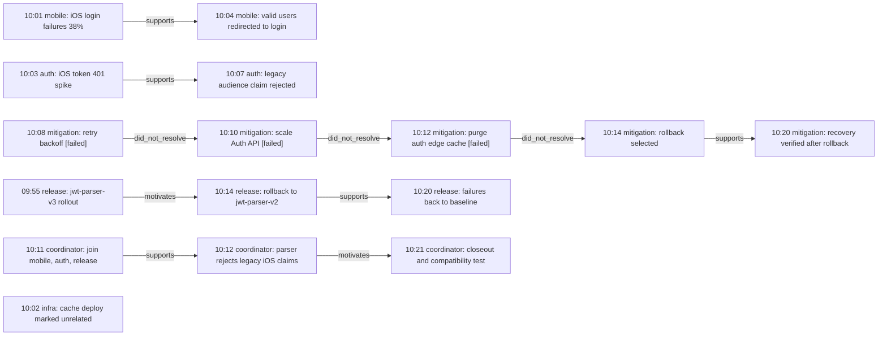

# Mobile Login Resolution Replay Demo

Date: 2026-05-05
Run id: `20260505T000318Z`
Status: live MCP run against the deployed Kubernetes kernel

## Purpose

This demo is designed for an article about the kernel as an observable memory
runtime. The object of the demo is not a token benchmark. The object is a
resolution replay: a reader can navigate the process that led from symptoms to
wrong turns, root cause, final fix, and audit evidence.

The article claim should be narrow and reproducible:

> The kernel lets an agent replay and inspect a multi-session reasoning process
> through deterministic temporal, dimensional, relational, and evidence APIs.

## Runtime

- Consumer: Codex using the `rehydration_kernel` MCP tools directly.
- MCP backend: live gRPC `KernelMemoryService`.
- Kernel release used in the surrounding validation: Helm `rehydration-kernel`
  revision `110`.
- Kernel image used in the surrounding validation:
  `ghcr.io/underpass-ai/rehydration-kernel:dev-93048c1`.
- Runner image used in the surrounding validation:
  `ghcr.io/underpass-ai/rehydration-kernel/e2e-runner:dev-7b02848`.

## Scenario

The demo models a mobile login incident across independent agent sessions. Each
agent writes to a separate `about`, and the replay queries decide whether to
inspect one session, several sessions, or the wider incident context.

Abouts:

| Agent/session | About |
| --- | --- |
| mobile-agent | `article:incident:mobile-login:20260505T000318Z:mobile` |
| auth-agent | `article:incident:mobile-login:20260505T000318Z:auth` |
| release-agent | `article:incident:mobile-login:20260505T000318Z:release` |
| coordinator-agent | `article:incident:mobile-login:20260505T000318Z:coordinator` |
| infra-agent | `article:incident:mobile-login:20260505T000318Z:infra` |
| mitigation-agent | `article:incident:mobile-login:20260505T000318Z:mitigation` |

Dimensions:

| Dimension | Role |
| --- | --- |
| `incident-timeline` | ordered observations and decisions |
| `evidence-stream` | supporting evidence and local facts |

## Memory Shape

| Session | Entries | Relevant role |
| --- | ---: | --- |
| mobile | 2 | user-visible symptom |
| auth | 2 | backend failure signature |
| release | 3 | rollout, rollback, recovery |
| coordinator | 3 | cross-session hypothesis and closeout |
| infra | 1 | unrelated distractor |
| mitigation | 5 | failed attempts and effective fix candidate |
| total | 16 | full replay with distractor |

The first coordinator wake was intentionally attempted before coordinator memory
existed. The kernel returned `NotFound`, which is useful for the article because
it shows fail-fast behavior instead of hidden fallback context.

The release ingest was also first attempted with temporal sequence `0`. The MCP
returned `InvalidArgument`: `memory.entries[].coordinates[].sequence must be
greater than zero`. The corrected ingest then succeeded. This is a useful
quality signal: invalid temporal coordinates are rejected at the API boundary.

## Replay Board

The figure below is the article's primary visual object. It is intentionally
small enough to understand without reading raw transcripts.



The infra node is intentionally standalone in the kernel graph. It appears only
when the infra about is included in the replay scope.

## Interactive Artifact

A static navigable version is available at
[`demos/mobile-login-resolution-replay/index.html`](demos/mobile-login-resolution-replay/index.html).
It has no backend, build step, package install, or CDN dependency. The data file
is a frozen client-side artifact derived from the live MCP run, so the demo can
be opened directly from disk or published as static documentation.

## Live MCP Results

| Query | Scope | Result | Article use |
| --- | --- | ---: | --- |
| `kernel_rewind` from sequence `99` | mobile + auth + release + coordinator + mitigation | 15 entries | replay the core incident without distractor |
| `kernel_rewind` from sequence `99` | same scope plus infra | 16 entries | show intentional inclusion of unrelated context |
| `kernel_near` around `attempt-cache-purge` | core incident scope | 6 entries | zoom into the decision point where wrong turns pivot to rollback |
| `kernel_trace` rollout to recovery | global graph path | 2 edges | prove the final causal path |
| `kernel_trace` first mitigation to recovery | global graph path | 4 edges | show failed attempts before the effective fix |
| `kernel_inspect` recovery verification | one node | 5 incoming links, 1 evidence item | audit why the final node is trusted |
| `kernel_ask` effective fix question | core incident scope | evidence and proof returned | deterministic context retrieval, not generative answering |

## Key Navigation Moments

### 1. Replay The Whole Process

`kernel_rewind` over the five core abouts returns the incident sequence without
the infra distractor. This is the main "resolution replay" path:

1. mobile failures and user impact appear.
2. Auth API 401s and legacy claim mismatch appear.
3. coordinator joins mobile, auth, and release context.
4. retry backoff, scaling, and cache purge are recorded as attempted fixes.
5. rollback is selected.
6. recovery is observed.
7. coordinator closes the incident with a parser compatibility follow-up.

Adding the infra about increases the replay from 15 to 16 entries and makes the
unrelated cache deploy visible. This gives the article a simple scope slider:
core incident only versus core incident plus distractor.

### 2. Show The Wrong Turns

`kernel_trace` from
`article:mobile-login:20260505T000318Z:attempt-client-backoff` to
`article:mobile-login:20260505T000318Z:attempt-recovery` returns four edges:

| From | Relation | To | Why |
| --- | --- | --- | --- |
| retry backoff | `did_not_resolve` | scale Auth API | backoff reduced repeated attempts but did not restore valid logins |
| scale Auth API | `did_not_resolve` | purge auth edge cache | capacity did not change the 401 rate |
| purge auth edge cache | `did_not_resolve` | rollback selected | cache purge did not change the iOS-only 401 pattern |
| rollback selected | `supports` | recovery verified | recovery followed rollback after earlier mitigations failed |

This is the most article-friendly proof that the kernel can preserve not just
the final answer, but also the process that did not work.

### 3. Show The Final Path

`kernel_trace` from
`article:mobile-login:20260505T000318Z:jwt-parser-rollout` to
`article:mobile-login:20260505T000318Z:recovered` returns two causal edges:

| From | Relation | To | Why |
| --- | --- | --- | --- |
| jwt-parser-v3 rollout | `motivates` | rollback | rollback targeted the parser change that preceded the iOS failure spike |
| rollback | `supports` | recovered | failures returned to baseline after reverting jwt-parser-v3 |

This gives the final resolution path as a compact proof, independent of raw
conversation text.

### 4. Inspect The Local Evidence

`kernel_inspect` on
`article:mobile-login:20260505T000318Z:attempt-recovery` returned:

- object text: `10:20 mitigation-agent verified iOS login failures returned to
  baseline after rollback, not after earlier attempts.`
- incoming structural links from the mitigation timeline and evidence stream.
- incoming record link from the mitigation about.
- incoming causal support from `attempt-rollback`.
- incoming evidential support: `Attempt log: backoff, scale-out, and cache
  purge did not restore login; rollback did.`
- no outgoing links.

This is the audit view for a single node. It answers "why should I believe this
memory object?" without rereading a long transcript.

### 5. Use Ask Carefully

`kernel_ask` was run with the question:

```text
What was the effective fix for the mobile login incident, and which attempted
mitigations failed before it?
```

The tool returned deterministic evidence and proof over the selected abouts.
The `answer` field is still best treated as retrieved context snippets, not as
a synthesized natural-language conclusion. For the article, use `because` and
`proof` as the authority, and use `trace` or `inspect` when presenting a
specific resolution claim.

## Why This Demo Is Stronger Than A Token Benchmark

- The object is visible: a small graph plus replay counts.
- The behavior is reproducible: each claim maps to a typed MCP/gRPC call.
- The demo includes mistakes: failed mitigations are first-class memory, not
  erased by the final answer.
- Scope is explicit: adding the infra about changes the replay from 15 to 16
  entries and makes the distractor visible.
- Audit is local: a reader can inspect the final recovery node and see incoming
  support.
- The kernel is not presented as an LLM judge. It is presented as deterministic
  memory infrastructure for agents.

## Article Structure

1. Start with the replay board.
2. Explain that each lane is a separate agent session stored under its own
   `about`.
3. Show `rewind` for the whole process.
4. Show `near` around the failed cache purge decision.
5. Show `trace` for wrong turns.
6. Show `trace` for the final path.
7. Show `inspect` for the recovery node.
8. Close with the engineering claim: durable, scoped, traversable memory makes
   agent work observable after the fact.

## Non-Claims

- This demo does not prove token reduction.
- This demo does not prove LLM task quality improvement.
- This demo does not use a medical scenario.
- This demo is synthetic, but the storage, traversal, trace, inspect, and
  fail-fast behaviors were exercised through the live MCP over the deployed
  gRPC kernel.
