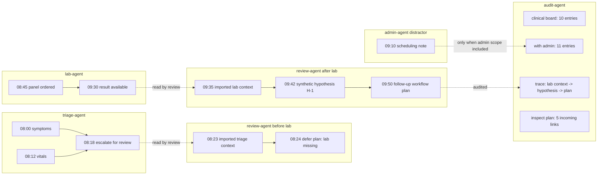

# Multi-Agent Case Board Demo

Date: 2026-05-05
Run id: `20260504T235333Z`
Status: live MCP run against the deployed Kubernetes kernel

> Synthetic case-board demo. This is not medical advice and does not model a
> real clinical workflow. The point is multi-agent memory: scoped, temporal,
> evidence-linked, and auditable.

## Why This Demo Works Visually

The demo is not a preloaded fixture. Codex acted as four different agents over
time, using the live `rehydration_kernel` MCP tools:

- `triage-agent`
- `review-agent`
- `lab-agent`
- `admin-agent`
- `audit-agent`

Each agent wrote local memory to its own `about`. The auditor then reconstructed
the case by selecting scopes explicitly.

## Agents And Memory Anchors

| Agent | About | Entries | Relations | Evidence |
| --- | --- | ---: | ---: | ---: |
| triage-agent | `article:case-a42:20260504T235333Z:triage` | 3 | 2 | 1 |
| review-agent, preliminary | `article:case-a42:20260504T235333Z:review` | 2 | 1 | 1 |
| lab-agent | `article:case-a42:20260504T235333Z:lab` | 2 | 1 | 1 |
| review-agent, final | `article:case-a42:20260504T235333Z:review` | 3 | 2 | 1 |
| admin-agent | `article:case-a42:20260504T235333Z:admin` | 1 | 0 | 1 |
| total |  | 11 | 6 | 5 |

## Progressive Run

### Phase 1: Triage Writes First

`triage-agent` wrote symptoms, vitals, and a review escalation. The review
agent then tried to wake from its own about before it existed. The kernel
returned `NotFound` instead of fabricating memory:

```text
KernelMemoryService.Wake failed:
node 'article:case-a42:20260504T235333Z:review' not found
```

The review agent then asked from the triage anchor and got deterministic
partial context: symptoms, vitals, and escalation, but no lab result.

### Phase 2: Review Writes A Deferred Decision

The first review ingest attempted to link directly to a triage ref from a new
payload. The kernel rejected the dangling relation:

```text
memory relation `triage-escalation` -> `review-needs-lab` references unknown refs
```

The review agent adapted by importing triage context into its own memory and
linking local review entries. This is useful for the article because it shows
fail-fast behavior instead of hidden fallbacks.

### Phase 3: Lab Arrives Later

`lab-agent` wrote the test order and later result. At that point the review
agent queried:

```text
scope=abouts
abouts=[triage, lab, review]
dimension=timeline
```

The kernel returned 7 temporal entries before final review, then 10 entries
after final review.

### Phase 4: Admin Adds A Distractor

`admin-agent` wrote a scheduling note. It is intentionally not part of the
case evidence chain.

The auditor compared:

| Query | Selected abouts | Entries |
| --- | --- | ---: |
| clinical board | triage + lab + review | 10 |
| board with admin note | triage + lab + review + admin | 11 |

This gives a simple visual claim: scope selection changes the board in a
predictable, auditable way.

## Figure



## Kernel Calls Covered

| Tool | Role | Result |
| --- | --- | --- |
| `kernel_ingest` | triage/lab/review/admin | wrote local memories by agent |
| `kernel_wake` | review | failed fast before review memory existed |
| `kernel_ask` | review | retrieved deterministic partial triage context |
| `kernel_rewind` | review/audit | built the temporal board across selected abouts |
| `kernel_trace` | audit | returned lab-context -> hypothesis -> plan |
| `kernel_inspect` | audit | returned plan details, 5 incoming links, 1 evidence item |

## Audit Results

| Audit | Result |
| --- | --- |
| clinical board after final review | 10 timeline entries |
| clinical board plus admin | 11 timeline entries |
| trace from lab context to follow-up plan | 2 path edges |
| inspect follow-up plan | 5 incoming links, 0 outgoing links, 1 evidence item |
| pre-review wake | fail-fast `NotFound` |
| cross-payload relation ingest | fail-fast `InvalidArgument` |

## Log Evidence

Kernel logs for the run show:

- `KernelMemoryService.Ingest` for triage accepted `entries=3`, `relations=2`, `evidence=1`.
- `KernelMemoryService.Wake` for review returned `NotFound` before review memory existed.
- `KernelMemoryService.Ingest` rejected the first review relation with `InvalidArgument`.
- `KernelMemoryService.Rewind` for triage + lab + review selected exactly those three abouts and returned `entries=10`.
- `KernelMemoryService.Rewind` for triage + lab + review + admin selected exactly those four abouts and returned `entries=11`.
- `KernelMemoryService.Trace` returned `path=2`.
- `KernelMemoryService.Inspect` returned `incoming=5`, `outgoing=0`, `evidence=1`.

## Article Claim

The visually simple claim:

> Multi-agent memory should not be a shared transcript. Each agent can write
> local, typed memory; another agent can later reconstruct the board by selecting
> abouts, dimensions, temporal position, and proof paths.

What the figure shows without much text:

1. Agents write independently.
2. The board grows over time.
3. Missing memory fails fast.
4. Scope determines what appears.
5. Audit reconstructs the proof path.

## Caveats

- The scenario is synthetic and intentionally non-medical.
- The review output is a workflow plan, not clinical advice.
- Cross-agent references were represented as imported context entries because
  ingest currently rejects dangling relations that reference refs outside the
  submitted payload.
