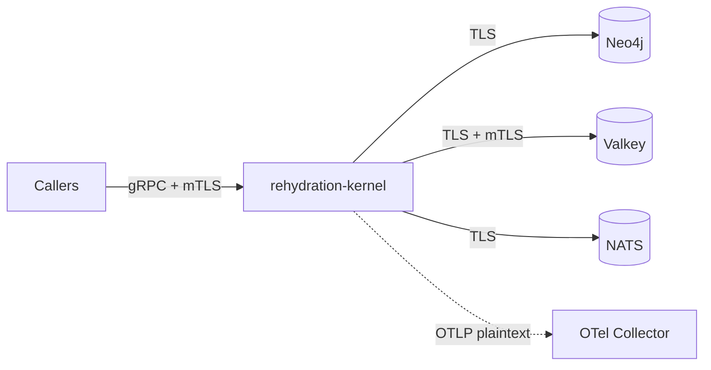

# Security Model

## Transport Security Posture

Every infrastructure boundary supports TLS. The gRPC transport supports
mutual TLS (mTLS). The OTLP export to the OTel Collector is **plaintext** today.

> **Gap**: Kernel → OTel Collector connection does not support TLS.
> The OTLP gRPC exporter uses `with_tonic()` without TLS configuration.
> mTLS support is in progress. Until then, co-locate the collector or network-isolate.

## Trust Boundaries

### Boundary 1: gRPC Transport → Kernel

- **TLS**: Full support for server TLS and mutual TLS via
  `REHYDRATION_GRPC_TLS_MODE` (`disabled`, `server`, `mutual`).
- **mTLS**: When `mode=mutual`, the kernel validates client certificates
  against a trusted CA. Only callers presenting a valid certificate are
  accepted. Configured via `tls.existingSecret` and `tls.keys.clientCa`
  in the Helm chart.
- **Authentication**: mTLS provides transport-level identity. No
  application-level identity extraction in v1beta1.
- **Authorization**: Not enforced in v1beta1. `ValidateScope` is a
  set-comparison utility, not an access control gate.

### Boundary 2: Kernel → Neo4j

- **Transport**: Supports `bolt+s://` and `neo4j+s://` (TLS) with private
  CA trust via `neo4jTls.existingSecret` in the Helm chart. The CA
  certificate is mounted as a volume and referenced via `tls_ca_path`
  in the connection URI.
- **Authentication**: URI-embedded credentials. Must be provided via
  Kubernetes secrets in production.
- **Client mTLS**: Not supported. The adapter validates the server's
  certificate against the CA but does not present a client certificate.
- **Authorization**: Single Neo4j connection identity per kernel instance.

### Boundary 3: Kernel → Valkey

- **Transport**: Supports `rediss://` (TLS) with mutual TLS via
  `valkeyTls.*` Helm values. Client certificate and key mounted from
  secrets for mTLS authentication.
- **Authentication**: TLS client identity or URI-embedded credentials.
- **Data at rest**: Valkey does not encrypt at rest by default. Snapshots,
  node details, and event store entries are stored as JSON.

### Boundary 4: Kernel → NATS

- **Transport**: TLS via `natsTls.*` Helm values. Supports CA pinning,
  client certificates, and `tls_first` for NATS TLS-first mode.
- **Authentication**: NATS connection credentials or TLS client identity.
- **Authorization**: Subject-level permissions managed in NATS server
  configuration, not in the kernel.

## Threat Model (v1beta1)

| Threat | Mitigation | Status |
|--------|-----------|--------|
| Unauthenticated gRPC access | Mutual TLS | **Implemented** |
| Man-in-the-middle on gRPC | Server TLS / mTLS | **Implemented** |
| Man-in-the-middle on Neo4j | TLS with CA pinning | **Implemented** |
| Man-in-the-middle on Valkey | TLS with mTLS | **Implemented** |
| Man-in-the-middle on NATS | TLS with CA pinning | **Implemented** |
| Unauthorized context reads | mTLS restricts callers; no fine-grained RBAC | Partial |
| Unauthorized context writes | mTLS + optimistic concurrency | Partial |
| Replay attacks on commands | Idempotency key outcome recording (returns same result for retries; application layer checks before processing) | **Implemented** |
| Credential exposure in config | Kubernetes secrets, not inline URIs | **Documented** |
| Data exfiltration from backends | TLS transport, network isolation | **Available** |
| Man-in-the-middle on OTLP | None — plaintext gRPC | **In progress** — mTLS support planned |
| Grafana anonymous access | Helm default: anonymous=false. Dev overlay enables it | Configurable via `grafana.anonymousAccess` |

## Helm TLS Configuration Summary

| Component | Helm Values | Modes |
|-----------|------------|-------|
| gRPC transport | `tls.mode`, `tls.existingSecret` | disabled, server, mutual |
| Neo4j | `neo4jTls.enabled`, `neo4jTls.existingSecret` | TLS with CA trust |
| Valkey | `valkeyTls.enabled`, `valkeyTls.existingSecret` | TLS, mTLS with client cert |
| NATS | `natsTls.mode`, `natsTls.existingSecret` | TLS, mTLS, tls_first |
| OTel Collector | — | **Plaintext only** (mTLS in progress) |

## Recommendations for Production

1. Set `tls.mode=mutual` for gRPC transport.
2. Enable `neo4jTls`, `valkeyTls`, and `natsTls` for all backend connections.
3. Use `secrets.existingSecret` for connection URIs — never inline credentials.
4. Restrict NATS subject permissions to kernel-owned prefixes.
5. Network-isolate the kernel namespace from untrusted workloads.
6. Set `grafana.adminPassword` to a strong value. Anonymous access is disabled
   by default (`grafana.anonymousAccess=false`); only the dev overlay enables it.
7. Co-locate or network-isolate the OTel Collector until OTLP mTLS is implemented.

## What the Kernel Does NOT Do

- Does not extract application-level caller identity from mTLS certificates.
- Does not enforce fine-grained RBAC or scope-based access control.
- Does not encrypt data at rest.
- Does not manage secrets or rotate credentials.
- Does not validate the truthfulness of application-supplied explanations.
