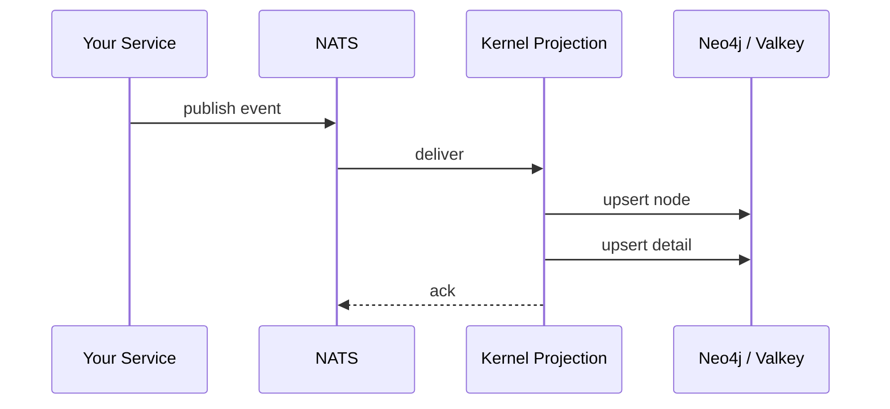
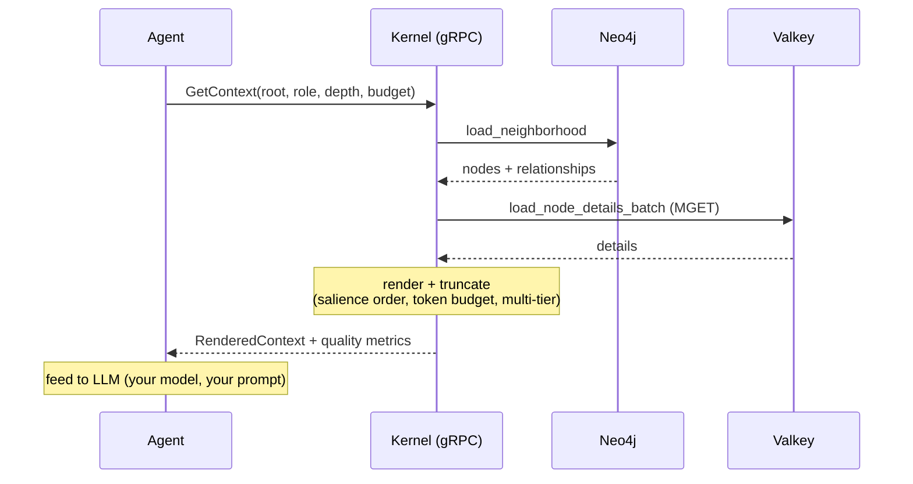
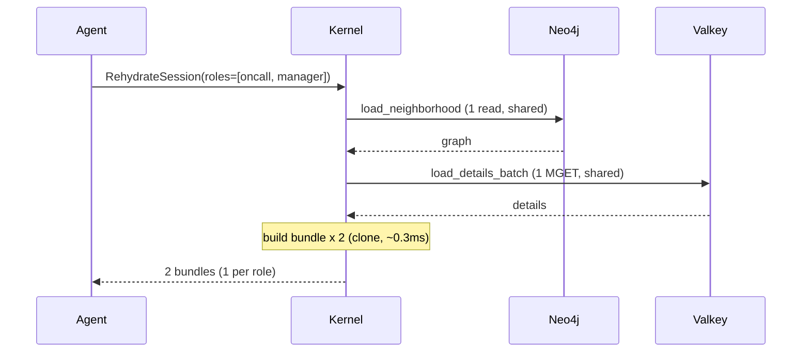
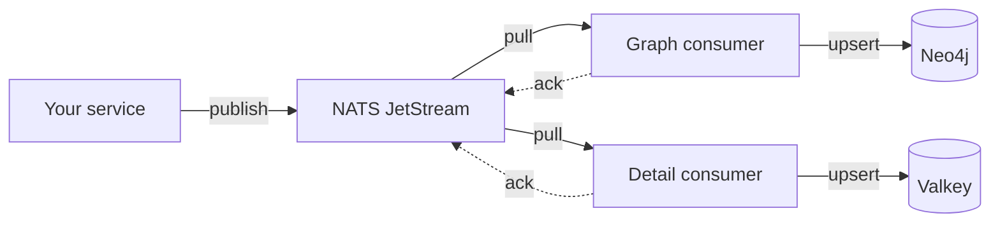

# Usage Guide

How to give your AI agent graph-aware context in 3 steps.

## Step 1 — Seed your graph

Publish projection events to NATS. Each event materializes a node or detail
in the kernel's graph store. Events follow the
[AsyncAPI contract](../api/asyncapi/context-projection.v1beta1.yaml).

**Materialize a node** (published to `rehydration.graph.node.materialized`):

```json
{
  "event_id": "evt-001",
  "correlation_id": "incident-7",
  "causation_id": "alert-latency-spike",
  "occurred_at": "2026-03-27T14:30:00Z",
  "aggregate_id": "incident-7",
  "aggregate_type": "incident",
  "schema_version": "v1beta1",
  "data": {
    "node_id": "node:incident:latency-spike",
    "node_kind": "incident",
    "title": "API latency spike in payments service",
    "summary": "P95 latency exceeded 2s threshold after config deployment.",
    "status": "investigating",
    "labels": ["payments", "latency", "p1"]
  }
}
```

**Materialize a related node with explanatory relationship:**

```json
{
  "event_id": "evt-002",
  "correlation_id": "incident-7",
  "causation_id": "evt-001",
  "occurred_at": "2026-03-27T14:32:00Z",
  "aggregate_id": "decision-reroute",
  "aggregate_type": "decision",
  "schema_version": "v1beta1",
  "data": {
    "node_id": "node:decision:reroute-traffic",
    "node_kind": "decision",
    "title": "Reroute traffic to secondary region",
    "summary": "Divert 80% of traffic while primary recovers.",
    "status": "accepted",
    "related_nodes": [
      {
        "node_id": "node:incident:latency-spike",
        "relation_type": "RESPONDS_TO",
        "explanation": {
          "semantic_class": "causal",
          "rationale": "latency spike caused by config error requires immediate traffic reroute",
          "method": "DNS weight shift to secondary region",
          "decision_id": "decision-reroute",
          "caused_by_node_id": "node:incident:latency-spike"
        }
      }
    ]
  }
}
```

**Materialize node detail** (published to `rehydration.node.detail.materialized`):

```json
{
  "event_id": "evt-003",
  "correlation_id": "incident-7",
  "causation_id": "evt-001",
  "occurred_at": "2026-03-27T14:31:00Z",
  "aggregate_id": "node:incident:latency-spike",
  "aggregate_type": "node_detail",
  "schema_version": "v1beta1",
  "data": {
    "node_id": "node:incident:latency-spike",
    "detail": "Config deployment at 14:25 changed connection pool size from 50 to 5 (typo). P95 latency rose from 120ms to 2.4s within 3 minutes. Error rate: 23% HTTP 503. Affected endpoints: /v1/payments/settle, /v1/payments/refund.",
    "content_hash": "sha256:a1b2c3",
    "revision": 1
  }
}
```



## Step 2 — Query context

Call the kernel via gRPC. The kernel traverses the graph, loads details,
renders text ordered by causal salience, and returns it within your token budget.

```bash
grpcurl -plaintext localhost:50054 \
  underpass.rehydration.kernel.v1beta1.ContextQueryService/GetContext \
  -d '{
    "root_node_id": "node:incident:latency-spike",
    "role": "oncall",
    "depth": 3,
    "token_budget": 2000
  }'
```

**What the kernel returns** (simplified):

```json
{
  "rendered": {
    "content": "Node API latency spike in payments service (incident): P95 latency exceeded 2s threshold after config deployment.\n\nRelationship node:decision:reroute-traffic --RESPONDS_TO--> node:incident:latency-spike [causal] because latency spike caused by config error requires immediate traffic reroute via DNS weight shift to secondary region\n\nDetail node:incident:latency-spike [rev 1]: Config deployment at 14:25 changed connection pool size from 50 to 5 (typo)...",
    "tokenCount": 187,
    "resolvedMode": "REHYDRATION_MODE_REASON_PRESERVING",
    "tiers": [
      { "tier": "L0_SUMMARY", "content": "Objective: API latency spike in payments service — P95 latency exceeded 2s. Status: investigating. Next: Reroute traffic to secondary region." },
      { "tier": "L1_CAUSAL_SPINE", "content": "Node API latency spike... Relationship RESPONDS_TO [causal] because latency spike caused by config error..." },
      { "tier": "L2_EVIDENCE_PACK", "content": "Detail: Config deployment at 14:25 changed connection pool size from 50 to 5 (typo)..." }
    ],
    "quality": {
      "rawEquivalentTokens": 342,
      "compressionRatio": 1.83,
      "causalDensity": 1.0,
      "noiseRatio": 0.0,
      "detailCoverage": 1.0
    }
  }
}
```



## Step 3 — Feed your LLM

Take `rendered.content` (or pick specific tiers) and include it in your prompt:

```python
# Full context — use rendered.content
context = response.rendered.content

# Or pick a tier — L1 for diagnosis, L0 for quick triage
# context = next(t.content for t in response.rendered.tiers if t.tier == "L1_CAUSAL_SPINE")

prompt = f"""You are the oncall engineer investigating an incident.
Here is the rehydrated context from the operations graph:

{context}

What is the root cause? What was the recovery decision and why?
Cite the rationale from the context."""

answer = llm.chat(prompt)
```

That's it. The kernel handles graph traversal, salience ordering, token
budgeting, and multi-resolution rendering. Your code just calls gRPC and
feeds the text to your LLM.

## RPCs

### ContextQueryService

| RPC | Use when | Key params |
|:----|:---------|:-----------|
| `GetContext` | Full context around a node | `root_node_id`, `role`, `depth`, `token_budget`, `max_tier`, `rehydration_mode` |
| `GetContextPath` | Context along a path (A → B) | `root_node_id`, `target_node_id`, `role`, `token_budget` |
| `GetNodeDetail` | Extended detail for one node | `node_id` |
| `RehydrateSession` | Bundles for multiple roles at once | `root_node_id`, `roles[]`, `persist_snapshot`, `snapshot_ttl` |
| `ValidateScope` | Check scope coverage (set comparison) | `required_scopes`, `provided_scopes` |

### ContextCommandService

| RPC | Use when | Key params |
|:----|:---------|:-----------|
| `UpdateContext` | Record a context change event | `root_node_id`, `role`, `changes[]`, `metadata` (idempotency_key, correlation_id) |

## Multi-Resolution Tiers

Every render produces three tiers. Pick the level you need:

| Tier | Content | Size | Use when |
|:-----|:--------|:----:|:---------|
| **L0 Summary** | Objective, status, blocker, next action | ~100 tok | Status checks, dashboards |
| **L1 Causal Spine** | Root + focus + causal/motivational/evidential chain | ~500 tok | Diagnosis, decision review |
| **L2 Evidence Pack** | Structural relations, neighbors, full details | remaining | Deep analysis, audit |

Request specific tiers:

```json
{ "root_node_id": "node:incident:latency-spike", "role": "oncall", "max_tier": "L1_CAUSAL_SPINE", "token_budget": 800 }
```

## Multi-Role Rehydration

`RehydrateSession` loads the graph **once** and builds per-role bundles from shared data:



## Token Budget and Quality

The kernel enforces a token budget using the `cl100k_base` BPE tokenizer.
Content is ordered by salience and truncated when the budget is exceeded.

The planner automatically selects a rehydration mode based on budget pressure
and graph content:
- **ReasonPreserving** (default): all tiers populated, full rationale
- **ResumeFocused**: under tight budgets, prunes L2 evidence to preserve L1 causal spine
- When `causal_density >= 50%`, the planner keeps ReasonPreserving even under pressure

Every response includes quality metrics and auditability data:

| Field | What it tells you |
|:------|:------------------|
| `compressionRatio` | How much the kernel compressed vs a flat dump (>1.0 = savings) |
| `causalDensity` | Fraction of explanatory relationships (higher = richer signal) |
| `detailCoverage` | Fraction of nodes with extended detail loaded |
| `noiseRatio` | Fraction of noise/distractor nodes (0.0 for clean graphs) |
| `resolvedMode` | Which rehydration mode the planner selected |
| `contentHash` | Deterministic hash of rendered content — verify the LLM received what the kernel produced |
| `truncation` | Budget requested vs used, sections kept vs dropped (when budget applied) |

### Provenance

Both nodes and relationships carry optional provenance metadata:
- `source_kind`: HUMAN, AGENT, PROJECTION, DERIVED
- `source_agent`: identifier of the agent that wrote the data
- `observed_at`: ISO-8601 timestamp

This enables auditability: if an LLM cites rationale from a relationship,
the consumer can verify who originally wrote that rationale.

## Event Store and Projection Runtime

### How events become graph state

When you publish events to NATS, the kernel's projection runtime materializes
them into Neo4j (graph) and Valkey (details):



Two durable pull consumers run in parallel:
- `context-projection-graph-node-materialized` — writes nodes + relationships to Neo4j
- `context-projection-node-detail-materialized` — writes detail to Valkey

Both use explicit ack. If a handler fails, the message is nak'd (requeued)
and the runtime stops — operator must investigate and restart.

### Event store backend

The kernel supports two event store backends for `UpdateContext`:

| Backend | Config | Behavior |
|:--------|:-------|:---------|
| **Valkey** (default) | `REHYDRATION_EVENT_STORE_BACKEND=valkey` | Events stored as RESP keys, idempotency via key lookup |
| **NATS JetStream** | `REHYDRATION_EVENT_STORE_BACKEND=nats` | Events stored in `CONTEXT_EVENTS` stream, file-backed |

Both implement the same `ContextEventStore` port with:
- **Atomic CAS** — NATS uses `Nats-Expected-Last-Subject-Sequence` header; Valkey uses a Lua EVAL script. Concurrent writes to the same `(root_node_id, role)` are rejected with `ABORTED`
- **Idempotency** — outcome recording by key; same key returns same result on retry
- **Revision tracking** — monotonic per `(root_node_id, role)` pair

### NATS JetStream subjects

| Subject pattern | Purpose |
|:----------------|:--------|
| `{prefix}.graph.node.materialized` | Inbound: nodes + relationships |
| `{prefix}.node.detail.materialized` | Inbound: extended detail |
| `{prefix}.cmd.evt.{root_node_id}.{role}` | Event store: command events |
| `{prefix}.cmd.idem.{key}` | Event store: idempotency outcomes |

Prefix is configured via `REHYDRATION_EVENTS_PREFIX` (default: `rehydration`).

### Operational notes

- **Ordering**: sequential within each subject, no cross-subject ordering between graph and detail
- **Failure**: handler error stops the runtime (nak + exit). No poison-pill queue — operator must investigate
- **Deduplication**: application-level via Valkey (`ProcessedEventStore`), separate from JetStream ack
- **Checkpointing**: stored in Valkey (`ProjectionCheckpointStore`), survives restarts
- **State dependency**: even with NATS event store, the projection runtime always uses Valkey for deduplication and checkpoints

### Retry semantics for consumers

The kernel provides **at-least-once** delivery with idempotency key support.
Consumers should design for safe retries.

**UpdateContext retries:**

```
Client                          Kernel
  │                                │
  │  UpdateContext(key="abc")      │
  │───────────────────────────────>│  1. Check idempotency key "abc"
  │                                │  2. Not found → process command
  │                                │  3. Append event (revision N+1)
  │                                │  4. Record outcome for key "abc"
  │  ←── OK (revision N+1)        │
  │                                │
  │  (network timeout — retry)     │
  │                                │
  │  UpdateContext(key="abc")      │
  │───────────────────────────────>│  1. Check idempotency key "abc"
  │                                │  2. Found → return cached outcome
  │  ←── OK (revision N+1, same)  │  (no re-processing)
```

**Rules for consumers:**

- Always set `metadata.idempotency_key` on `UpdateContext`. Without it, retries
  are treated as new requests
- Use a deterministic key per logical operation (e.g. `{correlation_id}:{entity_id}`)
- If you get `ABORTED` (revision conflict), reload current revision and retry
  with the new `expected_revision`
- Idempotency outcomes are persisted but not TTL'd — they live as long as the
  event store retains data

**Projection event retries (NATS):**

- Durable consumers with explicit ack — messages are redelivered on nak
- Application-level deduplication via `ProcessedEventStore` (Valkey) prevents
  re-processing of already-materialized events
- If the projection handler fails, the runtime stops. Restart the pod to
  resume from the last acked message

**Known limitation:** idempotency outcome publish is fire-and-forget. If the
event appends but the outcome publish fails (network issue), the next retry
will be treated as a new request. The kernel logs a warning when this happens.

## Further Reading

- [Proto contracts](../api/proto/underpass/rehydration/kernel/v1beta1/) — gRPC API definition
- [AsyncAPI contract](../api/asyncapi/context-projection.v1beta1.yaml) — event schema
- [Reference fixtures](../api/examples/kernel/v1beta1/grpc/) — example request/response JSON
- [Integration contract](migration/kernel-node-centric-integration-contract.md) — stability rules
- [Beta status](beta-status.md) — RPC maturity, path to v1, known limitations
- [Observability](observability.md) — quality metrics, OTel, Loki, Grafana
- [Testing](testing.md) — how to run the test suite
